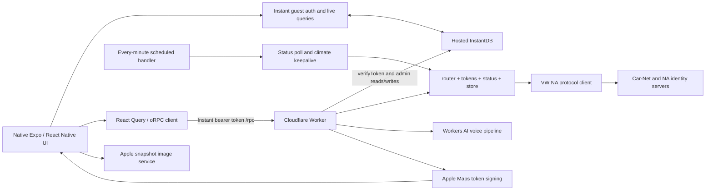

# Current architecture — Phase 0 evidence

Inspected 2026-10-02 America/Chicago. Repository: `https://github.com/ecardoso626/vwapp`, branch `umbrel-selfhosted`, commit `15500a78ff6a33310e443c91a9b6c3e62554b2cc` (`v1.0.24`). The local fork at `/Users/cardosofam/vwapp` was clean. Its source was byte-for-byte equal to the separate upstream reference checkout used for dependency installation and validation. No VW requests were made; upstream comments saying “verified live” describe the author's past observations, not verification performed in this inspection.

This document is a historical Phase 0 source snapshot. Phase 3 removed the voice/AI paths described below; Phase 4 added a separate Node runtime beside the Worker. See `MIGRATION_PLAN.md` §17 and `docs/NODE_RUNTIME.md` for the current state.

Source references below are repository-relative paths and original line numbers. The immutable [source tree](https://github.com/ecardoso626/vwapp/tree/15500a78ff6a33310e443c91a9b6c3e62554b2cc) is the baseline. See `MIGRATION_PLAN.md` for proposals and `PHASE0_COMMAND_LOG.md` for commands/results.

## System and navigation

The workspace is `app`, `backend`, `packages/contract`, `packages/db`, and `packages/poc`. The app entry is `expo-router/entry`; routes live in `app/src/app`, with providers/components outside the route tree. `app/src/app/_layout.tsx` mounts gesture, theme, safe-area, keyboard, React Query, session, and transient login providers. `Stack.Protected` switches between login/PIN and the authenticated stack. `(app)/_layout.tsx` declares the dashboard first and climate as an iOS native form sheet. Other screens are doors/windows, parked location, activity, messages, message detail, status-update times, and settings. This is already a native UI, not a webview/PWA.

Tamagui handles layout/theming, with `@expo/ui/swift-ui` gauges, pickers, steppers, toggles and date controls; `expo-symbols` supplies SF Symbols. `react-native-gesture-handler` and Reanimated power message swipes. Theme preference is in-memory, resets across launches. `useNow` updates labels every 30 seconds (climate 15 seconds), **not network polling**. The dashboard selects the first permitted vehicle; selecting a UUID is supported by many RPC inputs but there is no multi-vehicle picker.

## Mobile data and authentication

`app/src/db.ts` initializes Instant's React Native SDK with the shared schema and `EXPO_PUBLIC_INSTANT_APP_ID`. `polyfills.ts` installs Expo's secure random implementation before Instant imports `react-native-get-random-values`. Vehicles, snapshots, messages, and climate sessions stream directly from InstantDB; mobile code does not write those entities directly.

`app/src/rpc.ts` creates an oRPC `RPCLink` and TanStack Query utilities. It resolves `EXPO_PUBLIC_API_URL` first, otherwise a development-only Metro host on port 8787, otherwise throws. It reads `db.getAuth()` and sends the Instant guest refresh token as a bearer token. React Query is used for mutations **and reads** (`auth.me`, activity, climate target, signed map URL), not exclusively actions as some prose suggests. There is no explicit global retry policy; `auth.me` specifies two retries, climate target uses 60-second stale time, and map URL uses 25 minutes. Mutation pending state is local; command history is not persisted for the phone.

`session-provider.tsx` observes `db.useAuth`, tries a Keychain token, or creates an Instant guest. Instant also persists its own auth in AsyncStorage; `auth-storage.ts` adds a Keychain mirror using `AFTER_FIRST_UNLOCK`, without biometric access control. Errors from Keychain operations are swallowed. Despite the provider's general intent to preserve identity during outages, **any** error from `signInWithToken(saved)` clears the saved Keychain token and tries a new guest; it does not distinguish invalid credentials from connectivity failure. Logout detaches the client from the VW account; local discard signs out of Instant and deletes the Keychain copy. Neither operation stops backend polling or revokes VW tokens.

`login.tsx` sends username/password to `auth.checkCredentials`. The server stores a validated session before PIN entry; canceling the PIN screen therefore does not erase that server session. `login-flow.tsx` holds credentials in React memory, and `login-pin.tsx` clears that context on unmount. The login screen's own state and React Query mutation variables can also retain submitted values while mounted/cached; “context cleared” is not a guarantee of memory erasure. PIN syntax is 4–6 digits. `auth.login` saves the encrypted credential envelope **before** its best-effort status read validates the supplied PIN, so login can report success despite a bad PIN.

## Worker and storage lifecycle

`backend/src/index.ts:18` exports Worker `fetch` and `scheduled` handlers, not a long-running Node server. Each obtains an Instant admin client from `store.getDb`. `fetch` verifies any Instant bearer token, maps verification failure to a null user, dispatches under `/rpc`, and returns 404 if unmatched. The CORS plugin uses defaults. The error interceptor logs the entire error object. There is no application-specific request replay cache, device allowlist, rate limiter, HTTP deadline, health endpoint, or protocol-version handshake.

`scheduled` runs `pollAllVehicles` and `runClimateKeepalive` independently via two `ctx.waitUntil` calls. `wrangler.jsonc` has a one-minute cron, `nodejs_compat`, compatibility date `2026-06-01`, observability enabled and an `AI` binding. There is no D1, KV, Durable Object, R2, queue or local disk persistence. Development `pnpm dev` runs Wrangler plus an infinite curl loop against `/cdn-cgi/handler/scheduled`, so it is not a safe offline smoke test once credentials exist. The AI binding may use hosted inference in development.

`packages/db/src/index.ts` is the schema; `backend/instant.schema.ts` re-exports it. There are no schema migration files. `backend/instant.perms.ts` denies everything by default, allows guest `$users` creation and self-view, and permits vehicle/snapshot/session/message reads through account-user links. `vwAccounts` remains inaccessible to clients. Admin SDK access bypasses these permissions, so `router.ts` performs ownership resolution. Accounts survive with zero linked clients; account deletion cascades to vehicles/messages, and vehicle deletion to snapshots/climate sessions. The admin wipe script is destructive.

### Complete InstantDB interaction inventory

All backend entries use `INSTANT_APP_ID` + `INSTANT_ADMIN_TOKEN`; they are admin queries/transactions, not realtime subscriptions. Every app live query uses the guest identity and `instant.perms.ts` relationships. Backend mutations reach the UI through those subscriptions unless noted. “No retention” below means **no explicit pruning policy in inspected code**, not guaranteed provider retention.

| Module / operation                                                      | Access and data                                               | Relationship / consumers / behavior                                                                                                                   |
| ----------------------------------------------------------------------- | ------------------------------------------------------------- | ----------------------------------------------------------------------------------------------------------------------------------------------------- |
| `store.ts:getDb`                                                        | Initialize admin SDK                                          | Called by Worker fetch/scheduled; all server persistence depends on it                                                                                |
| `index.ts:fetch`                                                        | `db.auth.verifyToken`                                         | Refresh token → `$users.id`; failure collapses to unauthenticated                                                                                     |
| `store.ts:getUser`                                                      | Read `$users → account → vehicles`                            | Every account-bound RPC; tolerates wipe races as detached user                                                                                        |
| `getAccountByUserKey`                                                   | Read `vwAccounts` by SHA-256 normalized email                 | Compare-first login; username digest is linkable metadata                                                                                             |
| `listAccounts`                                                          | Read all accounts with vehicles                               | Poll all stored accounts, including ones with no attached user                                                                                        |
| `resolveAccountUpsert`, `vehicleUpsertOps`                              | Read account/garage, build upserts                            | Stable local vehicle IDs by UUID; absent garage vehicles are not explicitly pruned                                                                    |
| `saveAccountSession`                                                    | Create/update encrypted credentials, plaintext tokens, garage | Credential-check step; does not attach client; no retention                                                                                           |
| `saveLogin`                                                             | Same upserts, unlink previous account, link current `$users`  | Login switches account attachment; transaction but earlier lookup is not serialized                                                                   |
| `updateTokens`                                                          | Write access/refresh/id token, expiry, PKCE verifier          | `tokens.reauth`; reusable material plaintext                                                                                                          |
| `saveCarnetToken`                                                       | Write JSON map UUID → token/expiry; update in-memory account  | Drop expired other entries on save; server-only but plaintext                                                                                         |
| `clearUserData`                                                         | Unlink account/users only                                     | Logout; keeps guest, garage, credentials, tokens, automation                                                                                          |
| `saveSnapshot`, `getLatestSnapshot`                                     | Read latest then conditionally create snapshot                | Status/commands/poll; newest by `createdAt`, vehicle link; force write for lock optimism                                                              |
| `latestParkedAt`                                                        | Read latest snapshot's `parkedAt`                             | Climate resume decision, no independent location subscription                                                                                         |
| `pruneSnapshots`                                                        | Read/delete at most 200 rows older than cutoff per tick       | Global 30-day cutoff, no full sweep loop                                                                                                              |
| `getActiveClimateSession`                                               | Read active session by vehicle                                | Router and assistant; only first matching row returned                                                                                                |
| `listActiveClimateSessions`                                             | Read active sessions → vehicle → account                      | Keepalive work list; skips orphaned rows                                                                                                              |
| `startClimateSession`                                                   | End prior active row + create new active row                  | Temp, start/end times; no DB unique-active constraint                                                                                                 |
| `updateClimateSession`, `endClimateSession`                             | Write remaining time, pause, errors, expiry, state            | Router/keepalive; terminal rows retained with no explicit pruning                                                                                     |
| `syncMessages`                                                          | Read account messages, upsert VW fields, prune absent rows    | Preserve local `readOverride` and `deletedAt`; newest 50 VW messages; prune entire inbox only if response has <50, otherwise only fetched time window |
| `setMessageReadOverride`                                                | Account-scoped query then write nullable read override        | No VW write; missing message returns false but RPC still returns ok                                                                                   |
| `setMessageDeleted`                                                     | Account-scoped query then write/clear `deletedAt`             | Local soft deletion, survives resync; no VW write                                                                                                     |
| `router.ts` callers                                                     | Indirect reads/writes through all above helpers               | Auth, refresh, commands, climate, message RPCs; no separate data repository boundary                                                                  |
| `tokens.ts` callers                                                     | Token read from passed account, helper writes                 | Relogin and carnet caching tied to Instant-backed `Db`                                                                                                |
| `status.ts` caller                                                      | Indirect carnet read/write                                    | Protocol status read itself does not access DB                                                                                                        |
| `poll.ts` callers                                                       | Account/session lists, snapshots/pruning/session updates      | One-minute work; parallel jobs may race                                                                                                               |
| `assistant.ts:runAssistant`                                             | Latest snapshot + active climate session reads                | Prefetch context; uses router for other operations                                                                                                    |
| `app/src/db.ts`, `polyfills.ts`                                         | Initialize RN SDK, import schema/random polyfill              | Shared global live-query client                                                                                                                       |
| `session-provider.tsx`                                                  | `useAuth`, restore token, guest sign-in, sign-out             | Identity creation/changes, auth subscriptions; Keychain mirror                                                                                        |
| `app/src/rpc.ts`                                                        | `getAuth`                                                     | Instant token needed for every authenticated RPC                                                                                                      |
| `(app)/index.tsx`                                                       | Live vehicles + latest snapshot by local vehicle ID           | Dashboard; no snapshot triggers one **wake-capable** refresh RPC                                                                                      |
| `(app)/doors.tsx`                                                       | Same live vehicles/latest snapshot                            | Closure visual/detail                                                                                                                                 |
| `(app)/parked.tsx`                                                      | Same live vehicles/latest snapshot                            | Coordinates; map itself via RPC/Apple image                                                                                                           |
| `(app)/updates.tsx`                                                     | Same live vehicles/latest snapshot                            | Category timestamps; button calls wake-capable refresh                                                                                                |
| `(app)/activity.tsx`                                                    | Live vehicles + latest 500 snapshots                          | Local diffs merged with separately fetched VW activity; no persisted derived event table                                                              |
| `components/climate-control.tsx`                                        | Live active climate session by local vehicle ID               | Shows managed session as climate on, not independently observed physical state                                                                        |
| `(app)/messages.tsx`                                                    | Live account-permitted messages ordered by createdAt          | Hide `deletedAt` locally; sync RPC on mount/pull; read/delete via RPC, no local optimistic row cache                                                  |
| `(app)/message.tsx`                                                     | Live message by VW `messageId`                                | Marks read through RPC on mount; permission confines account                                                                                          |
| `activity-events.ts`, `charge-control.tsx`, `index.tsx`, `messages.tsx` | `InstaQLEntity<AppSchema,...>` type imports                   | Compile-time coupling beyond actual query sites                                                                                                       |
| `backend/scripts/auth-check.ts`                                         | Admin create token/user                                       | No VW traffic, but **remote auth mutation**; not run                                                                                                  |
| `backend/scripts/smoke.ts`                                              | Admin create token + RPC login/refresh/logout                 | Refresh wakes; optional lock/unlock; not run                                                                                                          |
| `backend/scripts/assistant-smoke.ts`                                    | Admin create token + login/assistant/logout                   | Hosted AI and potentially physical actions; not run                                                                                                   |
| `backend/scripts/wipe.ts`                                               | Query entities, delete rows/users                             | Destructive cascade; not run                                                                                                                          |
| README/CLAUDE schema/perms push recipes                                 | `instant-cli push`                                            | Remote schema/permission mutation; not run                                                                                                            |

No Instant storage/files, rooms, presence, topics or mobile direct entity transactions were found. Snapshot pruning is the only timed history retention. Messages use local overrides; climate sessions are durable automation state. Optimism is mostly outside Instant: lock button displays intended action while pending; the backend forcibly writes the intended lock state after the confirmation attempt.

### Data classification

| Category               | Actual storage                                                                                                                                                            |
| ---------------------- | ------------------------------------------------------------------------------------------------------------------------------------------------------------------------- |
| VW credentials/secrets | `vwAccounts.credCiphertext/credIv` AES-GCM envelope containing username/password and optional S-PIN; root `.env` template is for manually supplied live probe credentials |
| Sessions/tokens        | Plaintext account fields accessToken, refreshToken, idToken, codeVerifier, carnetTokens; tokenExpiresAt metadata                                                          |
| Current vehicle state  | `vehicles` identity + most recent `snapshots`; no separate current-state entity                                                                                           |
| Historical state       | snapshots, terminal climateSessions, mirrored messages; VW activity is fetched rather than persisted                                                                      |
| User/authentication    | Instant `$users`, accountUsers link; Instant-managed refresh tokens, AsyncStorage and Keychain client copies                                                              |
| Configuration          | Worker secrets/config and mobile build env; runtime theme in memory; no general configuration entity                                                                      |
| Other                  | Climate session intent/paused state, message local read/delete overrides, temporary voice audio; no command audit entity                                                  |

## VW protocol and preservation boundary

The production client is `backend/src/vw/client.ts` (1,302 lines). Its only workspace import is **type-only** `StatusDTO`/`VehicleDTO`. It uses standard fetch/Response/URL/TextEncoder/Web Crypto/base64/timers. No Cloudflare binding is needed inside this file. `packages/poc/src/vwClient.ts` uses Node crypto/tough-cookie and is historical reference, not a replacement: its status reads still use access-token auth and it lacks the production refresh/session implementation.

| Stage                              | Actual implementation and invariants                                                                                                                                                                                          |
| ---------------------------------- | ----------------------------------------------------------------------------------------------------------------------------------------------------------------------------------------------------------------------------- |
| Identity                           | NA `b-h-s.spr.us00.p.con-veh.net` and `identity.na.vwgroup.io`; Android public client IDs; `kombi:///login`, `openid`; EU CARIAD unsupported                                                                                  |
| Login, `client.ts:287,394`         | Manual redirects (up to 31 fetch iterations), cookie jar with domain/path/host-only rules, 302/303 POST→GET conversion; HTML hidden inputs + embedded csrf/relayState/hmac scrape; terms/password/throttle recognition        |
| PKCE                               | 64 random bytes represented as uppercase hex; S256 challenge; generated OAuth state is sent, but callback state is not explicitly checked in the inspected flow                                                               |
| Token exchange/refresh, `:507`     | Both grants send `play_integrity_token="unavailable"`; refresh replays original code_verifier; omitted replacement refresh token keeps old one                                                                                |
| Shared session, `router.ts:94–307` | Normalized username SHA-256 convergence; decrypt stored password then digest comparison; working garage call proves saved session; refresh before full login where possible; checkCredentials caches even before PIN          |
| Token manager, `tokens.ts:27–145`  | Access expiry safety margin 60s; refresh failures fall back to password login; forced reauth bypasses refresh; no account mutex/cooldown                                                                                      |
| Vehicle discovery, `client.ts:549` | `/account/v1/garage`, access bearer; accept wrapped or unwrapped garage; UUID is vehicleId or uuid; VIN and UUID both required                                                                                                |
| S-PIN, `:681`                      | GET challenge; reject remainingTries <3; SHA-512 of `challenge + "." + spin`, lowercase hex; POST session `{idToken,spinHash,tsp:"WCT"}`, access bearer; id_token is in body; 403 session response becomes incorrect PIN      |
| Carnet cache                       | Account JSON map by UUID; decoded JWT expiry or 25-minute fallback, refresh 3 minutes early; cached read token reused; lock/wake and many EV operations mint fresh tokens                                                     |
| Status, `:578`, `status.ts:21`     | Parallel GET RVS and charge summary with carnet bearer; one failed half rejects combined read; status retries once after VwAuthError with forced carnet re-mint                                                               |
| Payload parsing, `:607`            | SoC battery-first/fallback charging; range MI→rounded km; mileage fallback; nullable scalar values; friendly closure names; unknown/missing closure maps become empty lists; unknown non-SECURE strings become false          |
| History, `:860`                    | Carnet bearer; responseBody is nested JSON string; outcome 2 or /success/i code confirms; 0/3 rejects; accepted 1 and unknown outcomes continue; legacy nonempty failure code without outcome rejects; responseStatus ignored |
| Settings preservation              | Climate PUT reads existing element settings first, uses defaults if missing; charge-limit PUT reads and spreads full chargingSettings; neither preparatory raw fetch checks `ok` before fallback                              |
| Headers                            | Browser User-Agent, Accept, Accept-Language, x-requested-with, cookies; API User-Agent/Accept and bearer, JSON/form content-type as appropriate; no fabricated X-Spin header or client correlation header                     |

The attestation placeholder is an external viability risk: it is present in source, but no current live verification was authorized. If VW requires genuine attestation, Docker architecture cannot solve that on its own. Do not casually replace it or assert that it still works.

## Commands: acceptance versus execution

| Operation         | Submission and orchestration                                                                                                                                                                                 | Confirmation and current reported result                                                                                                                                                                                                                                                                                                                                                                                                                        |
| ----------------- | ------------------------------------------------------------------------------------------------------------------------------------------------------------------------------------------------------------ | --------------------------------------------------------------------------------------------------------------------------------------------------------------------------------------------------------------------------------------------------------------------------------------------------------------------------------------------------------------------------------------------------------------------------------------------------------------- |
| Lock/unlock       | `router.ts:394`, fresh S-PIN session then PUT `/lockunlock/v1/vehicle/{uuid}` with `{lock:boolean}`; on auth error forced password login and one retry                                                       | Requires correlationId; history defaults 8 attempts × 2.5s plus request time. Returned `confirmed:false` is ignored; history auth failure also falls through. Status is read, **locked is overwritten with requested value**, force snapshot inserted, `{ok:true,locked:want}` returned. Explicit command rejection errors out. Thus it is not reliably physical confirmation. A later status-read failure can also surface RPC failure after action execution. |
| Charge start/stop | `router.ts:826,864`; fresh carnet, POST `/charging/start                                                                                                                                                     | stop`with`{actionMode:"immediate"}`; EV busy retry 3 attempts, 5s apart                                                                                                                                                                                                                                                                                                                                                                                         | `confirmOp` 6 × 2.5s; explicit rejection fails, unconfirmed/auth failures ignored; best-effort snapshot; `{ok:true}` does not prove execution |
| Charge limit      | `router.ts:900`; 50–100 in tens; GET settings then PUT preserved settings + target                                                                                                                           | Same EV busy/confirmation/snapshot behavior; read-before-write fallback deserves fixtures                                                                                                                                                                                                                                                                                                                                                                       |
| Climate start     | `router.ts:620`; same temp + active session only extends expiry. Else fresh carnet per sequence; read physical climate; stop if necessary before changing temp; stop busy retry 3, set-temp retry 5, 5s gaps | Wait-off up to 5 reads/2.5s; settle-temp up to 8 reads/2.5s, best-effort. Start busy retry 3 then may defer to cron. Initial start does **not** poll correlation history; active managed session saved even when start deferred. UI session state can overstate actual climate state.                                                                                                                                                                           |
| Climate stop      | `router.ts:730`; paused session ends locally without VW; otherwise fresh carnet + stop                                                                                                                       | confirmOp then end active session. Failure/disconnect before tail can leave automation active; durable intent required later                                                                                                                                                                                                                                                                                                                                    |
| Climate keepalive | `poll.ts:91`; every minute checks active sessions, fresh carnet. Expired session submits stop then marks expired. Otherwise read climate, restart if off                                                     | Restart history 4 × 2.5s. Ignition rejection pauses, resumes after newer parkedAt or 10-minute fallback. Busy skips until next tick. Other errors saved/logged, usually leaves active session. Expiry stop is not terminally confirmed.                                                                                                                                                                                                                         |
| Wake/refresh      | `router.ts:328,355`; POST `/rvs/v1/vehicle/{uuid}/refresh`, fresh carnet, no body; one forced reauth retry                                                                                                   | Wake errors logged/swallowed; read current cloud state immediately. No correlation ID retained and no completion poll; fresh vehicle report can arrive later. Pull-to-refresh, menu refresh, updates button, and empty dashboard auto-refresh can wake.                                                                                                                                                                                                         |

Default history polling sleeps **before** each request; its attempt window is not a wall-clock timeout because individual fetches have no explicit AbortSignal/deadline. Non-401 history read failures, including 403/429/5xx, are swallowed and retried. `apiGet` treats only 401 as `VwAuthError`; other non-2xx are generic Error. EV writes recognize `EV_THRESHOLD_EXCEEDED` as busy from payload, not a general 429 policy. There is no Retry-After handling, general exponential backoff, circuit breaker, password-login cooldown, or concurrency serialization. `TODO.md` already identifies auth refresh races, password throttling, and interrupted command tail work.

## Polling, history and freshness

`pollAllVehicles` processes accounts and vehicles sequentially, but status requests for RVS/charge run concurrently. A vehicle error aborts the remainder of that account's loop; other accounts continue. No-PIN accounts skip polling. Cron and HTTP requests can overlap, and climate work independently runs alongside status work.

`saveSnapshot` dedupes only when `capturedAt` is non-null and capturedAt, rvsUpdatedAt, doorsUpdatedAt, locksUpdatedAt and windowsUpdatedAt all match the latest row. It does **not** compare the actual values or explicitly compare chargeUpdatedAt/parkedAt; there can be lost value changes if timestamps do not change, and duplicate rows when capture time is absent. The old CLAUDE description “deduped on capturedAt” is incomplete. `createdAt` is insertion time, not last successful poll. There is no persistent lastFetchedAt, refreshRequestedAt, refresh completion evidence or request/response timing.

`capturedAt` prefers charge top-level capture, then battery capture, then RVS timestamp; it does not mean all categories were captured together. Only closure timestamps pass through seconds→milliseconds conversion; other timestamps are taken as supplied. UI “about once a minute” text conflates backend checks with actual vehicle reporting. The 500-snapshot client event window is not comprehensive long-term history. `activity-events.ts` requires known values on both sides for scalar diffs, but the protocol's empty closure lists already lose missing-data distinctions.

## Voice, maps and release configuration

Actual voice models in `assistant.ts:109–116` are Whisper large-v3-turbo, gpt-oss-120b and Deepgram Aura-2-en (Athena, WAV). CLAUDE/README still describe older GLM/MeloTTS variants. Voice prefills cached status/climate into the model, permits a six-turn tool loop and executes vehicle procedures in-process. Mutative tools use fire-and-forget `waitUntil`; voice unlock has no confirmation dialog. Raw transcript and tool results are logged. `voice-control.tsx` records m4a using `expo-audio`, reads with transitive `expo-file-system/legacy`, submits base64, plays returned audio, and logs recording URIs/lengths. No other source import of expo-audio was found.

`maps.ts` signs 30-minute ES256 MapKit JWTs using optional server team ID/key ID/.p8. Parked-map RPC returns an Apple Web Snapshot URL, and native `Image` downloads it; missing config returns null/coordinates. Map JWT contains issuer/time, not coordinate scoping despite a router comment claiming a one-image signature. `reverseGeocode` exchanges a server token and fetches an address for voice only. No native map module is installed. Native MapKit can eventually consume normalized coordinates directly; no phone-location permission is needed just to display the car's position.

No tracked or existing `ios/`, `app/ios/`, Android native project, Dockerfile, Compose file, GitHub workflow, automated unit tests, or fixtures were present. `app/.gitignore` excludes generated native directories. Manifests resolve Expo **57.0.8**, RN **0.86.0**, React **19.2.3**, @expo/ui **57.0.7**, Tamagui **2.5.1**, Instant **1.0.52**, oRPC **1.14.8**, Wrangler **4.114.0**, TypeScript **6.0.3**. README/CLAUDE's SDK 56 claim is stale.

`app/app.config.ts` optionally injects bundle ID, Expo owner, EAS project ID and `https://u.expo.dev/{id}`. Those values are client-visible configuration when injected; “config-time only, never bundled” comments must not be treated as a security boundary. No bundle ID is set in the checked-in defaults. `app/eas.json` uses remote build numbers, production channel, auto-increment and an ASC placeholder. `publish:ios` invokes EAS cloud build/auto-submit, `submit:ios` invokes EAS submit, and `update` invokes EAS OTA. `with-asc-app-id.mts` temporarily edits eas.json; root `version` bumps and commits files. None was run. `pnpm ios` merely starts Expo/Expo Go; it does not generate/sign/archive a native app.

## Documentation contradictions to preserve as findings

- Read the current code over stale historical statements about access-token reads, no S-PIN for climate/charging, history auth, responseStatus, SDK version, voice models, canceled login persistence, and confirmed lock state.
- Existing credential encryption is real but incomplete: session/control tokens and verifier are plaintext.
- Existing UI already has native sheets and SF Symbols; these are opportunities to keep, not an unbuilt rewrite requirement.
- Existing `auth-check` mutates hosted identity despite “no VW traffic”; status smoke wakes, and the PoC script named `lock` defaults to **unlock** without an action argument.
- No source fixes, command changes, dependency removals, credential setup, account creation, native generation, signing changes or deployments were performed in Phase 0.
