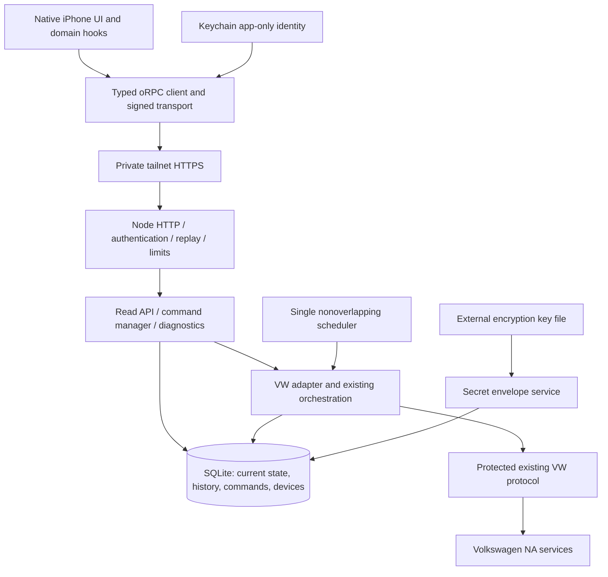

# VWApp migration plan — Phase 0

Inspection date: 2026-10-02, America/Chicago. Repository: [ecardoso626/vwapp](https://github.com/ecardoso626/vwapp), upstream [sstur/vwapp](https://github.com/sstur/vwapp). Local repository `/Users/cardosofam/vwapp`, branch `umbrel-selfhosted`, baseline `15500a78ff6a33310e443c91a9b6c3e62554b2cc` (`v1.0.24`). The working tree was clean before these documentation files were added.

**Scope: inspection, safe baseline checks and planning only.** No application source, dependencies, credentials, signing settings or deployment configuration were changed. No VW calls, vehicle commands, wake requests, hosted authentication mutations or deployments were performed. Proposed schemas, commands and phases below are future work, not implemented features or authorization to start them.

**Phase 4 update:** A Node HTTP composition root now reuses the existing router, InstantDB store and scheduled jobs beside the unchanged Worker. Its scheduler is opt-in while both runtimes coexist, and its lifecycle is tested with synthetic services; see [Node runtime](docs/NODE_RUNTIME.md). No persistence or mobile cutover was started.

**Phase 5 update:** An additive SQLite foundation now lives under `backend/storage/`: versioned transactional migrations, domain current state and observations, coarse samples, future command records, AES-256-GCM secret envelopes, rotation, and a WAL-safe backup API. It is tested with synthetic data and is not wired into production Worker/Node/InstantDB paths. See [SQLite storage](docs/SQLITE_STORAGE.md) and [analytics data foundation](docs/ANALYTICS_DATA_FOUNDATION.md). Node's built-in SQLite API avoids a package native addon but is experimental on the supported Node 22 line; validate the pinned ARM64 Linux image before deployment.

**Phase 6A status:** A second SQLite migration and `backend/auth/` provide offline-tested NIP-98 verification, pairing, device revocation, replay persistence, and rate limits. The Node entrypoint now applies this boundary before oRPC; bare Instant guest tokens cannot reach Node RPC. InstantDB remains the application data owner, with guest-token verification available only after device authorization. The Worker and mobile routes are unchanged; no deployment occurred. See [authentication](docs/AUTHENTICATION.md).

**Phase 6B status:** Node now composes the same router, token manager and scheduler with a SQLite application store, one owner identity, encrypted reusable VW secrets, domain current state/observations, legacy snapshot compatibility, climate sessions and message overrides. Worker and mobile remain on InstantDB. Only synthetic data and offline VW fixtures were used; no live import, VW call or deployment occurred. See [Node SQLite cutover](docs/NODE_SQLITE_CUTOVER.md). The earlier phase descriptions below remain planning history; command durability is still required before any live control cutover.

**Phase 7 status:** Mobile passive owner, vehicle, normalized state, observation history and VW-message reads now use NIP-98 signed Node cache endpoints. A dedicated BuzzKey key lives in iOS Keychain. Worker/Instant guest auth remains for live controls, VW login/logout, climate session and parked-map URL; no data import or control cutover occurred. The independent Node account must be linked separately before it has live vehicle data. See [mobile Node cutover](docs/MOBILE_NODE_CUTOVER.md).

**Phase 3 update:** The voice/AI vertical slice was removed from the mobile app, Worker, shared contract, configuration, and dependencies. The 54 existing offline VW tests and 13 adapter/domain tests remain the regression baseline. Phase 4 followed as a separate runtime step.

**Phase 2 update:** The 54 existing offline VW tests are joined by 13 adapter/domain tests. A typed, additive VW adapter and conservative vehicle model now exist without changing current Worker/Instant call paths or VW protocol behavior; see [the domain model](docs/DOMAIN_MODEL.md). Phase 1.1 covered the main VW request and parsing paths plus charging, climate keepalive, wake and representative retries; see [VW protocol test coverage](docs/VW_PROTOCOL_TEST_COVERAGE.md). The Phase 0 baseline and its historical statements remain as recorded. Production VW behavior was not changed. [BuzzKey product identity](docs/PRODUCT_IDENTITY.md) now fixes the future native build identifiers, and [design direction](docs/design/DESIGN_DIRECTION.md) records the later UI goals.

Companion evidence: [current architecture](ARCHITECTURE_CURRENT.md), [security design and threat model](SECURITY_NOTES.md), [command/results ledger](PHASE0_COMMAND_LOG.md). Source paths in these documents are repository-relative. Source observations take precedence over stale README/CLAUDE comments; live interoperability remains unverified.

## 1. Executive recommendation

**Migration practical: YES WITH CAVEATS.** Keep the native React Native/Expo application, Expo Router, existing native UI and oRPC contract. Put a conventional Node service around the existing North American VW protocol and orchestration. Make that service the phone's only data/control boundary. Use one SQLite database, one scheduler and one command manager for this household. Deploy as an ordinary ARM64 Docker Compose service on the existing UmbrelOS host.

The largest external risk is continued VW acceptance of the reverse-engineered authentication flow, especially its `play_integrity_token="unavailable"` workaround. Source inspection and offline tests cannot establish whether VW accepts it today. Phase 1 added behavioral coverage for the main protocol paths, including unconfirmed lock behavior; some climate and retry paths still need characterization before modification.

Do not perform a Cloudflare/Instant substitution while preserving two frontend data channels. Preserve the VW client **and the surrounding orchestration**, introduce interfaces around them, then move reads and commands through one authenticated API. Separate observed state from requested state; the current lock path writes the requested lock value even without confirmed execution. Complete encryption, device authentication, replay protection and command crash handling before any live cutover. UI redesign is last.

## 2. Technical feasibility and limits

| Target                             | Finding                                                                                                                                                                                                                                                       |
| ---------------------------------- | ------------------------------------------------------------------------------------------------------------------------------------------------------------------------------------------------------------------------------------------------------------- |
| Native iPhone                      | Already a native Expo/RN app with SwiftUI islands and SF Symbols. No reason to replace the stack or use a PWA.                                                                                                                                                |
| Local Xcode/TestFlight without EAS | Feasible in principle with locally generated native project, CocoaPods, Xcode signing/archive and App Store Connect. This repository has no `ios/` project; native compilation has not been demonstrated in Phase 0.                                          |
| Node backend                       | Production VW client imports only DTO types and uses standard web APIs. The installed oRPC server explicitly exports `@orpc/server/node`. Worker entry, environment, background lifecycle and persistence adapters need replacement.                          |
| SQLite                             | Appropriate for one owner, one vehicle and one writer process; no PostgreSQL justification. Phase 5 uses Node's built-in SQLite and tests backup/restore offline. The exact ARM64 Linux Node image and production restore procedure still require validation. |
| Private HTTPS                      | Existing Tailscale plus Serve can provide a stable authenticated HTTPS origin without a public control API. Host configuration remains to be inspected during deployment.                                                                                     |
| App-specific Nostr auth            | Feasible with maintained event/Schnorr primitives and a strict application NIP-98 policy. Not a drop-in substitute for guest auth: pairing, revocation, raw-body binding and persistent replay all matter.                                                    |
| Zero new hosted infrastructure     | Remove Instant, Worker/AI, EAS and server Maps signing where appropriate. Existing Apple distribution and VW services remain; this is not an offline vehicle protocol. No new cloud accounts are required by the design.                                      |
| Vehicle support                    | Source targets North American myVW/legacy Car-Net. It is not a generic VW-region adapter. Exact ID. Buzz capabilities and current endpoint acceptance require later explicitly authorized live validation.                                                    |

## 3. Baseline results and toolchain

The initial workspace `/Users/cardosofam/Documents/ChatGPT/VW ID Buzz App` contained an empty Git repository. An upstream reference was cloned into `/private/tmp/vwapp-phase0-reference` before the corrected local fork path arrived. After inspecting `/Users/cardosofam/vwapp`, commit identity and a recursive source comparison confirmed the same source. Dependencies and generated output stayed in the temporary checkout. These are checks of the fork's identical source snapshot, not a claim that a native build ran inside the fork.

| Component               | Exact observation / requirement                                                                                                                                                                                                                                                            |
| ----------------------- | ------------------------------------------------------------------------------------------------------------------------------------------------------------------------------------------------------------------------------------------------------------------------------------------ |
| Node                    | Installed and used: **22.23.2**, macOS arm64. No root `engines`, `.nvmrc` or `.node-version` pins an exact required Node. `CLAUDE.md` requests Node ≥24 for direct TypeScript scripts; baseline static/build commands succeeded on 22.23.2. Do not invent an exact repository requirement. |
| Node compatibility      | Resolved RN/Metro engine range includes `^20.19.4`, `^22.13.0`, `^24.3.0`, `>=25.0.0`; resolved Wrangler requires ≥22. A future Node server should pin a supported Node 24 LTS patch and validate it, rather than retain an unbounded range.                                               |
| pnpm                    | Repository pins **10.33.4**. Default shell fallback was 11.19.0. Corepack obtained 10.33.4 in a temporary cache; a temporary PATH shim ensured nested `pnpm` scripts also used it.                                                                                                         |
| Workspace               | Six projects including root; pnpm lockfile version 9; hoisted node linker. Install used frozen lockfile and disabled lifecycle scripts.                                                                                                                                                    |
| Resolved app            | Expo **57.0.8**, React Native **0.86.0**, React **19.2.3**, `@expo/ui` **57.0.7**, Tamagui **2.5.1**. Documentation still says Expo SDK 56.                                                                                                                                                |
| Resolved infrastructure | Instant **1.0.52**, oRPC **1.14.8**, Wrangler **4.114.0**, TypeScript **6.0.3**. Several manifests say `latest`; reproducibility currently depends on the lockfile.                                                                                                                        |
| Xcode                   | Installed **27.0**, build **27A266a**, selected at `/Applications/Xcode.app/Contents/Developer`. No signing settings were inspected/changed.                                                                                                                                               |
| Native minimums         | Installed RN helper reports minimum Xcode 16.1/iOS 15.1. Installed Expo, ExpoModulesCore and ExpoUI podspecs require iOS **16.4**, the higher observed floor. Meeting RN's Xcode floor does not prove full Expo 57 compatibility or native build success.                                  |
| CocoaPods               | `pod` not found. No repository Gemfile, Podfile or Podfile.lock. Future native generation needs a pinned CocoaPods/Ruby setup and then an actual pod resolution/build.                                                                                                                     |

| Validation                                                          | Result                               | Interpretation                                                                                                                                                                                   |
| ------------------------------------------------------------------- | ------------------------------------ | ------------------------------------------------------------------------------------------------------------------------------------------------------------------------------------------------ |
| Frozen dependency install                                           | **PASS**                             | 1,043 packages installed in temporary checkout; no source/lockfile changes, lifecycle scripts disabled.                                                                                          |
| Initial `pnpm test`                                                 | **FAIL**                             | Fresh clone lacked ignored `backend/worker-configuration.d.ts`; backend could not resolve Cloudflare globals/types. First run also exposed nested pnpm version mismatch. Not silently discarded. |
| Initial all-package typecheck                                       | **FAIL**                             | Backend failed; other four workspace packages passed. Missing CF types also affected generic `Response.json` typing.                                                                             |
| Initial lint                                                        | **FAIL**                             | Backend reported 45 type-aware errors with missing runtime types; no source auto-fixes made.                                                                                                     |
| `cf-typegen` first attempt                                          | **FAIL**                             | Sandbox denied workerd's local loopback listener (EPERM), not a source error.                                                                                                                    |
| `cf-typegen` permitted retry                                        | **PASS**                             | Generated ignored local runtime declarations. No deployed Worker or credentialed app was started.                                                                                                |
| Prepared `pnpm test`                                                | **PASS**                             | Root scripts and all package typecheck, lint and format checks passed with generated types and pinned pnpm. This command contains static checks, **not behavioral/unit tests**.                  |
| Expo public config resolution                                       | **PASS**                             | Offline config resolved with no owner/project/bundle identifier configured. Resolution does not prove runtime login/connectivity.                                                                |
| iOS JavaScript export                                               | **PASS**                             | Offline production native-target Metro/Hermes export and assets; approximately 6.4 MB JS bundle. No app login or vehicle traffic.                                                                |
| Worker build-only bundle                                            | **PASS after invocation correction** | First esbuild command omitted neutral-platform package main fields and failed to resolve `cookie`; adding `--main-fields=module,main` produced a 913.4 KB bundle. No source change.              |
| Native simulator/device/archive                                     | **SKIPPED**                          | No generated native project or CocoaPods; requires later native setup. JS export is not an Xcode build.                                                                                          |
| Live smoke/protocol scripts                                         | **SKIPPED**                          | Need credentials and/or mutate hosted state or control/wake a vehicle.                                                                                                                           |
| Dev server/cron, cloud deploy, Instant schema push, EAS, TestFlight | **SKIPPED**                          | Outside scope and may call live services, mutate state or require signing/accounts.                                                                                                              |

See the command ledger for exact validation invocations, failed attempts and inspection commands. No tests were rewritten to make this baseline pass.

## 4. Current and target boundaries

Current flow is detailed in [ARCHITECTURE_CURRENT.md](ARCHITECTURE_CURRENT.md): phone → Instant guest auth/live DB reads **and** phone → oRPC Worker → VW; Worker writes Instant; cron independently polls and maintains climate.

Proposed:



Only the backend talks to VW and persistence. Tailscale is host networking, not a new application dependency. The server runs without Codex, OpenClaw, an Umbrel framework, a browser, a phone connection or any AI service.

## 5. Mobile architecture to retain and decouple

Keep Expo Router navigation, Tamagui theme/layout, SwiftUI controls, SF Symbols, unit/closure display helpers, React Query and oRPC utilities. Replace `app/src/db.ts`, guest-session provider and Instant token lookup with domain hooks backed by API reads and a dedicated-device identity provider. Preserve login/PIN UI initially as a secure account-setup flow over the authenticated API; do not embed VW credentials in the phone bundle or persist them in AsyncStorage.

Screens directly coupled to live queries are dashboard, doors, parked, updates, activity, messages/message, and climate-control. Type coupling additionally appears in activity-events and charge-control. Replace each with typed hooks such as `useVehicleState`, `useClimateSession`, `useMessages`, `useCommands`. These hooks should initially use ordinary API polling while foregrounded and invalidate after mutations. Focus/connectivity can trigger **cached backend reads**, not a VW call or wake. Keep last good state through network errors and show its age; never reset device identity on a transport failure.

Do not rebuild navigation or styling while moving transport. A later UI redesign can replace components without touching protocol, database or authorization.

## 6. Backend shape and incremental repository structure

Retain `backend/`, `app/`, `packages/contract` and the existing monorepo. Keep `backend/src/vw/client.ts` at its current path to minimize noisy diffs. Add small modules when a boundary is actually needed:

```text
backend/src/
  index.ts                 # eventual Node composition root
  api/                     # oRPC context, authenticated read/control handlers
  auth/                    # device registry, NIP-98 ingress, pairing
  commands/                # durable jobs, reconciliation, per-vehicle serialization
  db/                      # SQLite connection, migrations, repositories
  domain/                  # normalized state and capability mapping
  scheduler/               # controlled polls, climate deadlines, pruning
  security/                # encryption envelopes and sanitized logs
  vw/client.ts             # protected existing protocol
  vw/adapter.ts            # new interface over protocol/orchestration
packages/contract/src/     # domain/API contracts; no DB-specific types
deploy/                    # Dockerfile, compose.yaml, operational instructions
```

`store.ts`, `tokens.ts`, `status.ts`, `poll.ts` and `router.ts` should be extracted incrementally, not all moved at once. Define repository and clock/transport seams around existing callers. A temporary Instant-backed repository can prove the interface using mocks, but the self-hosted release must not depend on it. Keep configuration validated at startup, one process owner of the database/scheduler, graceful stop, bounded shutdown and startup recovery. Prefer built-in Node HTTP with oRPC's installed Node adapter over introducing a framework without need.

## 7. VW protocol preservation

Freeze `backend/src/vw/client.ts` first. Protect the meaningful behavior in `tokens.ts`, `status.ts`, `router.ts` and `poll.ts` as well: the raw endpoint client alone does not contain compare-first login, refresh fallback, token caching, climate session management or command orchestration.

Required invariant fixtures include NA hosts/client IDs/redirect URI; custom cookie/redirect handling and scraped hidden fields; uppercase-hex PKCE verifier and S256; both grant bodies including original verifier and attestation placeholder; access versus carnet versus id token placement; UUID routing versus VIN identity; S-PIN GET challenge and remaining-attempt guard; lowercase SHA-512 `challenge.pin`; exact request payloads/headers; settings preservation; status fallback/unit conversions; history's nested JSON string; correlation IDs; busy retry and unconfirmed paths.

The production client is structurally portable to Node web APIs. Do not replace its cookie handling with the historical PoC merely because that code uses Node. Prove equivalent cookie, redirect, Web Crypto, base64 and fetch behavior offline before moving runtime. Changing existing bugs is a later explicit change with before/after tests, not a hidden cleanup during porting.

## 8. Persistence and lifecycle

Today Instant owns hosted storage, permission-filtered live queries and guest auth. Backend admin calls are the only entity writers. `vwAccounts` is shared by normalized username; vehicles and snapshots attach to the account, while users attach/detach independently. Logout leaves the account and background climate/polls active.

Preserve this distinction in the new owner/device model: disconnecting the phone is not deleting a VW account or stopping scheduled climate. Add an explicit separately confirmed account-removal procedure eventually. One household does not need a generic multi-tenant user/role system, but account/vehicle ownership and device permissions must remain explicit and enforced server-side.

Current state is currently the latest historical snapshot. Split current state from retained observations. Keep climate intent, paused/resume conditions, expiry and last safe error as durable data. Preserve message read overrides/deletion independently of VW message updates. Do not lose these subtleties by reducing persistence to a single JSON blob.

## 9. Current authentication and replacement boundary

Instant creates a guest identity; phone stores its refresh token in Instant's AsyncStorage layer and mirrors it to Keychain. Worker verifies it through Instant, then resolves the user's linked VW account. The phone separately sends username/password/PIN for backend VW setup. The account's password/PIN envelope is encrypted, but reusable access/refresh/id/carnet tokens and verifier are plaintext server-only fields.

Replace Instant identity with a dedicated per-device Nostr keypair, generated and stored locally on iOS. Backend holds only approved public keys. Keep VW authentication wholly separate: device authorization grants access to backend operations, and the backend alone manages VW credentials/tokens. Do not turn a social Nostr key into a vehicle key, introduce relays or ask a Nostr service to authorize commands.

Pairing/bootstrap, revocation, Keychain failure/recovery and request signing must work before switching mobile reads off Instant. Missing network is an offline state; it is not evidence the identity should be erased.

## 10. Existing commands and acceptance ambiguity

The detailed source-backed command matrix is in [ARCHITECTURE_CURRENT.md](ARCHITECTURE_CURRENT.md). Material behaviors to characterize:

| Command                  | Current behavior and risk                                                                                                                                                                                                                                                  |
| ------------------------ | -------------------------------------------------------------------------------------------------------------------------------------------------------------------------------------------------------------------------------------------------------------------------- |
| Lock/unlock              | Fresh S-PIN token; PUT with `{lock:boolean}`; correlation required; history polling defaults eight attempts at 2.5 seconds. Explicit rejection fails, but unconfirmed history is ignored. Backend overwrites observed lock state with requested value and returns success. |
| Charge start/stop/target | Fresh carnet; EV busy retries three attempts five seconds apart. Target modifies preserved settings. Six confirmation polls; explicit rejection propagates, missing confirmation/auth failures may not. Successful RPC is not proof of execution.                          |
| Climate start/change     | Same-temperature active session extends DB expiry only. Otherwise stop/change-temperature/start orchestration with separate retry/poll loops. Busy start can defer to cron; active session can exist before climate physically starts.                                     |
| Climate stop             | Paused session can end locally; otherwise sends stop, attempts confirmation then ends session. A late error can leave automation state diverged from vehicle.                                                                                                              |
| Climate keepalive        | Every-minute automation, expiry stop, restart if off, special pause after ignition-related failure, resume on newer parked timestamp or ten-minute fallback. Needs durable deadlines and restart reconciliation.                                                           |
| Wake/refresh             | Fresh S-PIN session then bodyless POST refresh, best effort. Wake errors swallowed and cached status read returns. No confirmed vehicle-response timestamp. Empty-dashboard auto-refresh can wake too.                                                                     |

No command table exists. A phone disconnection or Worker termination can hide final outcome. A failed status read after physical execution can report error even though action happened. Preserve these facts in tests, then replace optimistic completion with explicit uncertain/pending outcomes in a dedicated phase.

## 11. Freshness, polling and realtime

Current cron every minute calls ordinary VW status reads and climate keepalive separately, writes snapshots if selected timestamp/deduplication fields differ, and prunes 30-day snapshots in batches of 200. No account mutex prevents overlapping scheduled and interactive token work. `useNow` updates UI labels only; live queries supply data. Activity diffs at most 500 snapshots locally and also fetches VW history.

Define separate nullable times: `dataCapturedAt` (source-reported, possibly per field/group), `serverFetchedAt` (successful cloud fetch), `persistedAt`, `refreshRequestedAt`, and `vehicleRespondedAt` **only when evidence supports it**. Retain `lastPollAttemptAt` and `lastPollSuccessAt` separately. A fresh cloud read can contain old vehicle data. A changed capture timestamp can support “new report observed,” but may not uniquely prove a particular wake caused it; keep this correlation qualified.

Expose freshness as fresh/cached/stale/waiting-for-vehicle/unknown with reason and timestamps; do not invent precision absent in VW payloads. Define age per category where EV/RVS/closures/location have different clocks. Handle seconds/milliseconds/invalid/future times in tests; source currently converts closure timestamps differently from several other fields.

Initial target: foreground app reads cached API state around every 15–30 seconds and immediately on focus/after mutation, with a slower/offline-aware policy in background. Backend VW cadence remains independent and conservative: preserve the current one-minute baseline first under characterization, then make it configurable with explicit backoff, charging/climate context and no overlapping polls. Never assert the old comment “one-minute polling is safe” as a current VW guarantee. Wake is a distinct explicit command with cooldown; opening the app must eventually not wake the vehicle implicitly. Optional authenticated SSE can stream revision changes later if polling proves inadequate; do not recreate Instant rooms/subscriptions.

## 12. Native iOS model and opportunities

Keep current native navigation, form sheets, SF Symbols and SwiftUI controls. Keychain already exists and can hold the new app key; LocalAuthentication is a future addition for unlock confirmation. The private secp256k1 key is not automatically a Secure Enclave nonexportable key; Keychain storage plus software signing has a different threat model.

Native MapKit can replace server-signed parked-image URLs and remove server Apple Maps key custody. Displaying supplied vehicle coordinates does not itself require iPhone location access. Validate a maintained native map integration against Expo 57: current `expo-maps` documentation labels it alpha, so compare it with `react-native-maps` rather than committing blindly. [Expo Maps documentation](https://docs.expo.dev/versions/latest/sdk/maps/).

Widgets/Live Activities can display a sanitized timestamped state snapshot later, with appropriate app-group storage; do not place signing keys/VW tokens in a widget cache. They do not guarantee continuous private-network polling. APNs could notify command completion or stale-data conditions but adds server credentials, entitlements and Apple's delivery service. It is optional, not an MVP prerequisite. Neither widgets nor background modes justify claiming iOS can run the backend polling loop reliably.

## 13. Dependency classification

Decisions are migration targets; no dependencies changed in Phase 0. Keep exact current versions while adding characterization coverage. Resolve `latest` declarations to intentional ranges/pins in a later focused maintenance change, not as incidental migration churn.

| Dependency/group                                                                              | Decision                             | Reason / condition                                                                                                                                                                                 |
| --------------------------------------------------------------------------------------------- | ------------------------------------ | -------------------------------------------------------------------------------------------------------------------------------------------------------------------------------------------------- |
| React, React Native                                                                           | KEEP                                 | Native UI/runtime already fits target; no rewrite justification.                                                                                                                                   |
| Expo SDK, Expo modules/CLI                                                                    | KEEP                                 | Open-source native libraries/local generation do not require EAS cloud.                                                                                                                            |
| Expo Router                                                                                   | KEEP                                 | Existing native navigation and protected routes useful.                                                                                                                                            |
| `expo-secure-store`                                                                           | KEEP                                 | Keychain primitive; replace stored Instant token with dedicated key using tested accessibility policy.                                                                                             |
| `expo-crypto`                                                                                 | KEEP                                 | Existing secure randomness/polyfill and hashing; verify requirements of chosen Nostr package.                                                                                                      |
| `@expo/ui`, `expo-symbols`                                                                    | KEEP                                 | Existing SwiftUI controls/SF Symbols; validate native build.                                                                                                                                       |
| Tamagui, config/themes                                                                        | KEEP                                 | Working design system; defer substantial redesign.                                                                                                                                                 |
| `@tamagui/lucide-icons-2`                                                                     | INVESTIGATE                          | Audit remaining icon imports before pruning; do not remove shared UI infrastructure for voice alone.                                                                                               |
| `@tanstack/react-query`                                                                       | KEEP                                 | Becomes read/cache/mutation coordination layer for one API.                                                                                                                                        |
| `@orpc/client`, server, contract, react-query                                                 | KEEP                                 | Shared typed API useful; Node adapter already available at locked version. Add final-wire signing hook tests.                                                                                      |
| Zod                                                                                           | KEEP                                 | Input/domain/error validation and compatibility contracts.                                                                                                                                         |
| `@instantdb/admin`, react-native, core                                                        | REPLACE                              | SQLite repositories, backend read APIs, device auth; remove packages only after all consumers are gone.                                                                                            |
| `@vwapp/db`                                                                                   | REPLACE                              | Currently Instant schema/types; domain/API types belong in contract, SQLite schema server-side. Remove package only after imports disappear.                                                       |
| Worker runtime, Wrangler/workerd/generated CF types                                           | REPLACE then REMOVE                  | Node entry/config/scheduler; temporary type generation retained while Worker source still exists.                                                                                                  |
| Workers AI binding/models                                                                     | REMOVED (Phase 3)                    | Voice was unwanted; no replacement AI service.                                                                                                                                                     |
| EAS CLI scripts/config/owner/project/update URL                                               | REMOVE                               | Local Xcode and App Store Connect release path; EAS CLI invoked by scripts, not a runtime requirement.                                                                                             |
| `expo-updates` and OTA config                                                                 | REMOVE                               | Full native releases through TestFlight; no OTA target. Verify generated native configuration after removal.                                                                                       |
| `expo-audio`                                                                                  | REMOVED (Phase 3)                    | It was used only for voice recording/playback; microphone permission was removed with it.                                                                                                          |
| `expo-file-system/legacy` import                                                              | REMOVED (Phase 3)                    | Its voice-only import was deleted; `expo-file-system` was not a direct manifest dependency.                                                                                                        |
| AsyncStorage, NetInfo                                                                         | INVESTIGATE                          | Instant requires these; a future nonsecret cache/connectivity layer may still need them. Never use AsyncStorage for signing keys.                                                                  |
| `react-native-get-random-values`                                                              | INVESTIGATE                          | Instant/crypto polyfill relationship; keep secure randomness until new identity stack proves its replacement.                                                                                      |
| Gesture Handler, Reanimated, Worklets                                                         | KEEP                                 | Non-voice swipe/animation UI uses them.                                                                                                                                                            |
| Screens, Safe Area Context, Keyboard Controller                                               | KEEP                                 | Native navigation/layout/input behavior.                                                                                                                                                           |
| SVG and shared icon support                                                                   | KEEP / audit unused imports          | Do not prune by association with voice; verify actual remaining consumers.                                                                                                                         |
| Expo constants/linking/splash/status/system UI                                                | KEEP                                 | App startup/navigation/native styling; update only relevant cloud config.                                                                                                                          |
| Apple server Maps helper                                                                      | REPLACE later                        | Native map removes server signing secret; retain coordinates-only fallback. No native map package currently implements this screen.                                                                |
| `tough-cookie` in PoC                                                                         | KEEP as reference                    | Not used by production protocol; do not substitute it during runtime port.                                                                                                                         |
| TypeScript, ESLint/typescript-eslint, Prettier, sort-imports, strictest config, type packages | KEEP                                 | Existing static baseline useful; retain Expo lint config with Expo app.                                                                                                                            |
| Unit-test runner/fixtures                                                                     | ADD later                            | No existing behavioral suite. Prefer a small runner compatible with current TS/ESM, fake clock and fetch stubs; avoid live integration as default.                                                 |
| SQLite driver/migration library                                                               | INVESTIGATE then ADD                 | Evaluate Node built-in SQLite versus maintained driver such as better-sqlite3 on pinned Node/ARM64; transaction/backup support and binary builds decide. Do not add a heavy ORM for one household. |
| Nostr/Schnorr packages                                                                        | None currently; INVESTIGATE then ADD | Maintained Nostr event helpers and noble primitives, pinned and tested in Hermes/Node. No relay stack needed.                                                                                      |
| LocalAuthentication/native map                                                                | INVESTIGATE then ADD                 | Optional targeted native enhancements with actual simulator/device checks.                                                                                                                         |

## 14. Preservation boundaries A–I

| Boundary                      | Files and treatment                                                                                                                                                                                                                             |
| ----------------------------- | ----------------------------------------------------------------------------------------------------------------------------------------------------------------------------------------------------------------------------------------------- |
| A. Freeze/protect VW protocol | `backend/src/vw/client.ts`; token/status/orchestration behavior in `tokens.ts`, `status.ts`, `router.ts`, `poll.ts`. Establish synthetic fixtures before edits.                                                                                 |
| B. Keep contracts/types       | `packages/contract/src/index.ts`: keep oRPC/Zod foundation and useful DTOs; evolve additively toward domain types. Preserve API compatibility during transition.                                                                                |
| C. Cloudflare runtime         | `backend/src/index.ts`, `env.ts`, `wrangler.jsonc`, CF globals/typegen and worker scripts; replace composition/runtime, not endpoint protocol.                                                                                                  |
| D. Instant persistence        | `store.ts`, `packages/db`, `instant.schema.ts`, `instant.perms.ts`, admin env and scripts; replace through repository boundaries.                                                                                                               |
| E. Mobile direct DB           | `db.ts`, session/rpc/auth-storage/polyfills plus query sites/types listed in architecture inventory; migrate to domain hooks.                                                                                                                   |
| F. Voice/AI                   | `assistant.ts`, voice-control, assistant contract/router branch, dashboard component, AI binding, audio config/dependency, assistant-smoke. Remove as a complete vertical slice.                                                                |
| G. Cloud/EAS-only             | `app/eas.json`, publish/submit/update wrappers, cloud fields in app config, Expo owner/project/OTA templates, Cloudflare deploy config. Keep generic Expo app config.                                                                           |
| H. Generic backend            | Domain transformation, protocol fetch/crypto, oRPC contracts, scheduler business decisions can survive Node move with explicit environment/repository/clock interfaces. `maps.ts` crypto is portable but eventual native maps may eliminate it. |
| I. Missing characterization   | No tests/fixtures for cookies, authentication, tokens, S-PIN, normalization, commands, retries, history, climate lifecycle, store dedupe or ownership. Static checks do not cover them.                                                         |

Freeze manifest at baseline (SHA-256):

```text
backend/src/vw/client.ts  0de064dffce66ceb6a6992f59deda32e282cee57662dbc2565ccfc975b675859
backend/src/tokens.ts     1bcd30b801c769225204b0dd42abe8e1f664111cc6e44bc838256bf71c843fc0
backend/src/status.ts     810d5d88d79880188b6902cea5267c5086bb5890f7a7c0d884bbe2b3a36d7e0e
backend/src/router.ts     732e31097a29c976e8c01bac44bdeee68c14213b63699968b265432038e774cc
backend/src/poll.ts       ee13032a132fcc6b2cc532a1b4939d963b4536db1fbccd935ebb41e08b109823
pnpm-lock.yaml           7c83eb56c8c89983274ba99dc8718b7a5a2e370fc33a624dc0d51921550da306
```

## 15. InstantDB replacement map

The [complete interaction inventory](ARCHITECTURE_CURRENT.md#complete-instantdb-interaction-inventory) identifies each helper, app screen, script, read/write, auth context, relationship, realtime effect, pruning rule and optimistic behavior. Minimal replacement:

| Existing entity/behavior               | Category                  | Proposed replacement                                                                                                     |
| -------------------------------------- | ------------------------- | ------------------------------------------------------------------------------------------------------------------------ |
| `$users`, guest auth, accountUsers     | User/authentication       | `devices` allowlist plus owner/account authorization; no anonymous hosted users.                                         |
| `vwAccounts.credCiphertext/credIv`     | VW credentials            | Versioned AEAD `account_secrets` envelope, external key; preserve existing decrypt compatibility during import.          |
| access/refresh/id/verifier/carnet JSON | VW sessions               | Encrypted session/token envelopes; expiry/vehicle lookup metadata separate.                                              |
| `vehicles` with account link           | Current identity/config   | `vehicles` row with stable local ID, VW UUID, VIN, account FK, capability evidence.                                      |
| latest snapshot                        | Current vehicle state     | `vehicle_current_state`, one row per vehicle with revision and explicit times.                                           |
| snapshots                              | Historical state          | Bounded changed observations + optional coarse telemetry/events, not all full polls indefinitely.                        |
| climateSessions                        | Durable automation        | `climate_sessions` preserving temperature, duration, expiry, paused/last-error/resume semantics.                         |
| messages                               | Other/history/preferences | `messages` keyed by account + VW message ID, local readOverride/deletedAt preserved; paging/window-aware reconciliation. |
| live subscriptions                     | Data delivery             | Authenticated cached read APIs; foreground polling/invalidation first, optional SSE later.                               |
| permissions graph                      | Authorization             | Explicit server account/vehicle checks on every read and write; test cross-device/vehicle IDs even with one owner.       |
| env/theme/map config                   | Configuration             | Validated backend config, nonsecret app preferences; no generic hosted settings service.                                 |

No mobile direct DB transactions need migration. Most apparent optimism is local button state and forced lock snapshots; do not translate those into “confirmed” persisted events. Determine whether any real Instant dataset exists before designing an import operation. For a new personal instance, start empty and do not copy upstream owner data. If existing owner data must migrate, use a separately authorized sanitized export/import, encrypt on ingestion, verify counts/relationships and pause all writers; never silently dual-write.

## 16. Cloudflare replacement map

| Current use                                     | Node replacement                                                                                            |
| ----------------------------------------------- | ----------------------------------------------------------------------------------------------------------- |
| Worker `fetch`, ExecutionContext, `/rpc`        | Node HTTP server and oRPC Node adapter; explicit lifecycle/context.                                         |
| `scheduled`, one-minute Wrangler cron           | In-process scheduler with nonoverlap, shutdown and restart reconciliation; no host cron required initially. |
| `ctx.waitUntil` for poll/climate                | Await supervised work or persist durable jobs. Never detach a critical promise without recovery.            |
| `Env` bindings                                  | Startup-validated nonsecret config + protected secret-file reads.                                           |
| `AI` binding                                    | Removed in Phase 3; no substitute service.                                                                  |
| `nodejs_compat` / workerd globals               | Standard Node web APIs; characterize runtime-sensitive fetch/redirect/cookie/crypto semantics.              |
| Wrangler deployment, secret bulk, observability | Docker image/Compose, mounted config/secrets, safe structured logs/health.                                  |
| CF generated declarations                       | Remove after last Worker/AI type consumer disappears; use Node types.                                       |

No D1/KV/R2/Durable Objects/Cloudflare queues need migrating. Maps JWT signing is portable crypto, not intrinsically a Cloudflare feature. Worker source bundling passed, but that does not prove a Node server port or scheduled-job recovery.

## 17. Voice/AI removal — Phase 3 complete

The assistant RPC contract/router procedure, Worker inference pipeline, smoke script, dashboard microphone control, `expo-audio` dependency/plugin, microphone permission, Workers AI binding and voice-only reverse geocoding were removed. Parked-map signing, shared controls and the existing Worker/InstantDB vehicle flows remain. The untracked/generated native project will be regenerated later without the removed Expo audio plugin; there is no tracked `ios/` project to edit. Historical Phase 0 voice observations remain in the architecture and security evidence documents, explicitly marked as historical.

## 18. Expo/EAS separation

Expo libraries and local CLI are not synonymous with EAS. Current release helpers invoke EAS build/submit/update; `publish:ios` performs cloud build and auto-submit, `eas.json` uses remote version management, and `app.config.ts` conditionally adds owner, project ID and updates URL. The version helper can create Git changes/commits. These were not run.

Remove cloud release scripts, EAS file/fields and OTA dependency/config in a later phase. Keep app name/icons/splash/plugins and explicit stable bundle ID. Move build number/version ownership to local source/config with an intentional release increment. Public API URL is embedded client configuration, not a secret; Expo-prefixed values are bundled. Owner/project metadata injected through app config is also observable even if not named `EXPO_PUBLIC_*`.

Use only full native TestFlight releases. Do not replace EAS with another cloud build service. Local CLI invocations can disable telemetry and use the existing lockfile; no Expo account is needed for the target path.

## 19. Proposed normalized domain

Existing `StatusDTO` already provides useful normalization; evolve it instead of discarding it. It still exposes VW charge-state strings/friendly closure names, conflates absent closure lists with empty/closed lists and lacks explicit capability/freshness evidence. Phase 2 introduced the smaller additive model in [DOMAIN_MODEL.md](docs/DOMAIN_MODEL.md); the broader shape below remains future design, not implemented code.

Proposed conceptual shape, not code to compile:

```text
VehicleState
  identity: localId, displayName, model, VIN (authorized), opaque vehicle reference
  capabilities: per operation { support: supported|unsupported|unknown, reason, observedAt }
  battery: percent?, rangeKm?
  charging: state: charging|idle|complete|unknown; plug: connected|disconnected|unknown; targetPercent?
  security: locked|unlocked|unknown; closures with stable IDs and open|closed|unknown
  climate: observed mode?, targetC?, plus separate managed-session intent
  odometerKm?
  location: latitude?, longitude?, capturedAt?, accuracy/source if supplied
  freshness: per group capture/fetch/persist times, age/reason, refresh operation reference
  revision, schemaVersion
```

Battery percent/range/odometer/plug/location/closure values derive from real fields in RVS and EV summary. Display miles/Fahrenheit are presentation conversions; canonical units should be explicit, with rounding only at display boundaries where possible. Climate “session active” is desired automation state, not observed climate state. `dataCapturedAt` currently prefers charging then battery then RVS timestamps and can obscure different source ages.

Capabilities requested by UI include canLock/canUnlock/canStartClimate/canStopClimate/canStartCharging/canStopCharging/canSetChargeLimit/hasLocation/hasDoorStatus/hasWindowStatus. Internally use tri-state support with reason, not a default `true` from model name or a default `false` from one missing reading. Garage/privilege evidence may inform support if source actually supplies it; preserve unknown until validated. Separate durable support from temporary availability (expired session, stale state, cooldown or policy). Missing scalar data remains null/unknown, never a fake zero or “safe/closed” state.

## 20. Proposed durable command model

Use a durable `VehicleCommand` with local ID, idempotency key, authenticated requesting device/public key reference, account/vehicle, type, validated arguments, requested/submitted/accepted/completed timestamps, VW correlation ID, status, sanitized failure code/stage and evidence. Store requested state separately from current observed state.

Suggested transitions: `requested → submitting → accepted → waiting_for_vehicle → succeeded|failed|timed_out`; add `submission_unknown` for interrupted submission and `cancelled` only while cancellation can actually prevent submission. Acceptance requires the known VW acknowledgement; success requires known history or defensible state evidence. Record evidence source and time. A timeout means no confirmation by deadline, not proof the vehicle did nothing. Unsupported/no-correlation endpoints need an explicit “accepted, unconfirmed” outcome, not synthetic success.

Persist intent before network side effects and acknowledgement/correlation as soon as known. Serialize commands per vehicle, token refresh per account, and climate automation with user commands. On restart reconcile accepted jobs from history; never blindly resend an uncertain unlock/wake. New signed request + same logical idempotency key should retrieve the existing command after phone timeout. A reused key with different payload is an error. A command accepted by VW cannot be reliably undone by cancelling a local row or rolling back Git.

Initial UI can display request/acceptance/waiting/result in existing controls without redesign. Cached state remains observed; pending intent can be an explicitly labeled overlay. Audit retention should answer phone request, backend auth, VW submission, acknowledgement, execution evidence and failure stage without keeping secret-bearing bodies.

## 21. Proposed SQLite schema and migrations

Start with versioned SQL migrations in `backend/src/db/migrations`, a migration ledger/checksum, transactional migration application where supported and one startup migrator. Back up before upgrades; refuse an application older than the database schema it understands. Avoid destructive automatic downgrades.

| Table                   | Minimal purpose and constraints                                                                                                                                  |
| ----------------------- | ---------------------------------------------------------------------------------------------------------------------------------------------------------------- |
| `schema_migrations`     | Ordered version/checksum/applied timestamp.                                                                                                                      |
| `accounts`              | Stable local ID and minimal identity metadata; one household initially.                                                                                          |
| `account_secrets`       | Account/purpose unique, version/key ID/IV/ciphertext/tag; all reusable VW credentials/session material encrypted.                                                |
| `vehicles`              | Account FK, unique VW UUID per account, VIN/display metadata/capability evidence.                                                                                |
| `devices`               | Unique public key, label, permissions, created/revoked/lastSeen times.                                                                                           |
| `vehicle_current_state` | Vehicle PK/FK, normalized schema version/payload, revision, source/fetch/persist metadata; upsert on successful observation, retain last good state on failures. |
| `vehicle_observations`  | Vehicle + timestamp index; bounded materially changed states and source timestamps.                                                                              |
| `telemetry_samples`     | Optional coarse interval samples with selected numeric fields, unique vehicle/bucket. Add only if useful.                                                        |
| `vehicle_events`        | Derived transitions, evidence/observation links, deterministic dedupe key. Unknown→known need not create a false transition event.                               |
| `commands`              | Durable lifecycle/evidence, account/vehicle/device FKs, unique device+idempotency key, VW correlation index.                                                     |
| `command_events`        | Optional small stage timeline if command columns cannot explain failures; sanitized fields only.                                                                 |
| `climate_sessions`      | Durable desired settings, expiry, pause/resume/last-error state; at most one active per vehicle.                                                                 |
| `messages`              | Unique account+VW messageId; preserve readOverride/deletedAt across sync; source timestamps.                                                                     |
| `auth_replay`           | Unique event ID, device, expiry; atomic insert, cleanup expired only.                                                                                            |
| `pairing_invitations`   | Hashed one-time secret, expiry, bound candidate key, consumed time; local bootstrap policy.                                                                      |

Do not copy Instant's generic graph machinery. Use foreign keys and explicit transactions. WAL plus bounded busy timeout suits one process; never share the SQLite file over a network filesystem or scale multiple writers casually. Normalized state JSON is acceptable for current state/short observations; index query-critical IDs/times/status rather than a fully generic attribute table. Large raw VW responses are not needed in the production DB.

Driver choice remains open pending pinned Node/ARM64 tests. Evaluate native build/prebuilt binary availability, transactions, backup API, binding behavior and migration tooling. No SQL implementation or package installation is authorized in Phase 0.

## 22. History and retention strategy

Current snapshot dedupe is not full meaningful-state comparison: nonnull capture time plus RVS/doors/locks/windows times determine insertion; some changed fields can be missed, while null capture times can create a row every minute. Current 500-row activity limit may represent very different time spans. Retain old behavior in characterization, then explicitly migrate.

Proposed initial configurable defaults: current state retained while vehicle exists; changed full observations for 30 days; coarse 15-minute battery/range/charge/odometer samples for 90 days; sanitized commands/events for 90 days; logs for 7–14 days with size limits. These are starting policy choices, not requirements or claims of existing behavior. Location deserves shorter retention or exclusion from coarse telemetry by default. Messages/session history need separate bounded policies instead of indefinite accumulation. The owner can choose longer retention later without redesigning storage.

Always update successful fetch/freshness metadata even when vehicle values are unchanged. Write observations on meaningful value/source transitions, derive events deterministically, and optionally sample coarse telemetry once per bucket. Do not store a full duplicate every minute forever. Prune in small indexed batches outside critical command transactions and test time-based retention with a fake clock. Monitor DB size; no need for a time-series service.

## 23. Security architecture and encrypted secrets

Full design: [SECURITY_NOTES.md](SECURITY_NOTES.md). Require private tailnet HTTPS plus per-device app authentication. The API must remain protected even if a proxy accidentally exposes it. Store only the app key's public half on the server. Device key never goes to VW/Umbrel logs/Git; VW tokens never go to mobile.

Extend current AES-GCM protection to all reusable VW material before production SQLite ingestion. Use platform AES-256-GCM, fresh 96-bit IVs, version/key ID and authenticated record-purpose binding. Keep master key in a protected read-only mounted file outside database/source/image/client bundle. Reject missing/wrong keys without silently deleting data or performing password-login storms. Key rotation and DB+key backup/restore are part of acceptance, not optional later cleanup.

Use Face ID/LocalAuthentication as an intent-specific unlock gate; distinguish cancellation from backend failure. Client biometric gating does not prove user presence to the server after a signing key is stolen. Do not claim secp256k1 uses the P-256 Secure Enclave key API. Minimize credential retention in phone forms/mutation caches and use safe error/log projections, not raw exception serialization.

## 24. NIP-98, pairing, replay and rate limits

Use maintained Nostr event/Schnorr verification primitives; no manual elliptic-curve crypto, no public relays, no NIP-44/59 without a separate use case. Current upstream NIP-98 helper APIs are not sufficient by themselves for this security boundary. [NIP-98 specification](https://github.com/nostr-protocol/nips/blob/master/98.md) and the [library assessment](SECURITY_NOTES.md#library-assessment) support a narrow reviewed integration.

Application policy: validate kind 27235, content/field shapes, event ID/signature, unique exact URL/method/body-hash tags, public-key allowlist/revocation and two-sided timestamp skew. Proposed tolerance ±60 seconds. Hash exact serialized request bytes, including oRPC's final envelope, and verify before body parsing. Configure trusted external HTTPS origin; never reconstruct it from arbitrary forwarded headers. Fresh nonce per actual request prevents same-second event collisions.

Atomically consume persistent event IDs before accepting operations, retain through their full validity window, and fail closed on storage exhaustion. Concurrent duplicates/restarts must not bypass replay protection. Pair auth consumption and durable command creation transactionally. Distinguish replay prevention from command idempotency. Rate-limit unauthenticated ingress, signing verification, device operations, pairing attempts and VW account/vehicle activity; serialize refresh and writes.

Pair by local operator approval of a displayed key fingerprint or a short-lived high-entropy invitation bound to key/origin. Never accept the first unknown key automatically. Recovery is local revoke-and-pair, with explicit consideration of pending automation. Restoring an old DB must not re-enable subsequently revoked devices unnoticed. Library selection and Hermes behavior remain test gates, not a promise that an unpinned current package will work.

## 25. Failure taxonomy and diagnostics

Current handling distinguishes some `VwAuthError`, `VwCommandError`, PIN and EV busy outcomes, but generic API GET errors collapse many 403/429/5xx responses. Non-401 history errors are swallowed during polling; wake failures are swallowed; most requests have no AbortController deadline. `EV_THRESHOLD_EXCEEDED` receives targeted retries; there is no general Retry-After support, jittered backoff, circuit breaker or shared login cooldown. Refresh-token failure can trigger password login; forced paths bypass refresh. Detailed current loops are in the architecture document.

Proposed safe error categories:

| Class                                                                         | Evidence / intended treatment                                                                                   |
| ----------------------------------------------------------------------------- | --------------------------------------------------------------------------------------------------------------- |
| `BACKEND_UNREACHABLE`                                                         | Mobile transport failure; preserve identity/state, retry cached reads conservatively.                           |
| `DEVICE_UNAUTHORIZED`, `REQUEST_REPLAYED`, `CLOCK_SKEW`, `RATE_LIMITED_LOCAL` | Backend auth policy; no VW call; safe actionable UI.                                                            |
| `VW_AUTH_REQUIRED`                                                            | Session cannot recover; preserve stage/status, avoid repeated full logins.                                      |
| `PIN_REQUIRED`, `PIN_INVALID`, `PIN_ATTEMPTS_LOW`                             | Existing explicit S-PIN conditions; no guessing/repeated challenge loop.                                        |
| `VW_BUSY`, `VW_RATE_LIMITED`, `VW_UNAVAILABLE`                                | Explicit busy payload, HTTP 429, or transport/5xx evidence; preserve distinction and retry-after when supplied. |
| `COMMAND_REJECTED`                                                            | Known VW rejection/history outcome; safe code/reason.                                                           |
| `COMMAND_UNCONFIRMED`, `COMMAND_TIMEOUT`, `SUBMISSION_UNKNOWN`                | No confirmation / deadline / crash ambiguity; not proof of nonexecution.                                        |
| `DATA_STALE`, `DATA_UNAVAILABLE`                                              | Cached-state condition, not necessarily an exception or sleeping vehicle.                                       |
| `CAPABILITY_UNAVAILABLE`                                                      | Unsupported/unknown/temporarily unavailable with reason.                                                        |

Do not assert `VEHICLE_ASLEEP` or `VEHICLE_UNREACHABLE` based solely on stale timestamps, timeout or generic 403. Expose those labels only when an actual payload provides defensible evidence; otherwise report unconfirmed/unavailable.

Add bounded request deadlines and per-operation retry policy **after** characterization. Reads/refresh may support backoff; a possibly accepted write must not be retried as if safe. Backoff with jitter/cooldown and circuit state should prevent password/S-PIN storms. Preserve explicit protocol workarounds and classify outcomes without leaking raw payloads.

Health: minimal unauthenticated liveness only; authenticated readiness/diagnostics report DB/schema status, backend version, supported API versions, last poll attempt/success, known VW session state (unknown/valid-until/recovery-required, without tokens), data age, last observed vehicle report and safe stage failures. A health read never logs into VW or wakes a car. Readiness should distinguish functioning local service with stale VW data from a broken local database. Log request/command/internal vehicle/device IDs, stage/status/duration/retry count; no raw headers, auth events, HTML, transcript or reusable secrets.

## 26. Docker/ARM64 and operations

Use ordinary Compose on UmbrelOS as a Linux host. Proposed configurable data root `/home/umbrel/umbrel/app-data/vwapp/`, with database/data separate from config and secret files. No `umbrel-app.yml`, Umbrel APIs, Docker socket, privileged mode, OpenClaw or Codex runtime. Source of truth is Git; image built from a known commit/lockfile, replaceable and portable to another Docker host.

Target properties: multi-stage pinned Node image, ARM64-tested SQLite driver, nonroot fixed UID, `restart: unless-stopped`, read-only root filesystem where feasible, writable data volume and bounded temp directory, healthcheck that reads local readiness, log rotation, read-only secret mount, host publication `127.0.0.1:<port>:<container-port>`. Existing host Tailscale Serve provides HTTPS to loopback; no Funnel/public ingress. Validate reachability and trusted origin on the actual host later.

One service initially owns API/scheduler/DB. Shutdown stops accepting new writes, drains bounded in-flight work and persists uncertain outcomes; restart inspects pending jobs before enabling commands. Do not run both Worker cron and new scheduler against the same vehicle. Explicitly disable old writers before any authorized cutover. Container updates never depend on mutable code edits inside the running image.

Backup SQLite through backup API or quiescence (WAL-safe), with schema/image/config metadata. Store matching encryption keys in a separate encrypted recovery backup. Test DB integrity, decryptability, migrations, revoked devices and pending-command reconciliation during offline restore. DB without key cannot recover secrets; DB plus key exposes them. Never replay all pending commands after restore. Rollback requires a compatible image/schema or restored matched backup, not just `git checkout`.

## 27. Exact intended local iOS workflow

**Current native project status:** no tracked or existing `ios/` or `app/ios/` project was found in inspected source. `app` is the Expo project root. Local native generation is therefore required for this repository's current shape; it is not a universal Expo assumption. The current `ios` script is `expo start --ios`: it starts Expo/Expo Go and does not generate, compile, sign or archive a native app. The future local command is `expo run:ios`, which can generate a missing native project. For a reviewable migration, generate explicitly after cloud config removal and inspect the diff.

Future workflow, not executed here:

1. Pin Node/pnpm/Ruby/CocoaPods and install frozen dependencies. Prepare nonsecret app config (stable chosen bundle identifier, local version/build number, private HTTPS API origin). Remove Instant and EAS requirements only after their consumers migrate; the current app requires Instant config at runtime even though offline export passes.
2. From `app/`, run the locally installed `pnpm exec expo prebuild --platform ios --no-install` on a dedicated change, after checking resolved config. Do not use `--clean` casually once hand-edited native code exists. Generated workspace/project name must be read from actual output, not guessed now.
3. Establish a pinned Gemfile/Bundler CocoaPods setup, then install pods in generated `app/ios` (for example `bundle exec pod install` with Gemfile location chosen consistently). Commit Podfile.lock and decide generated-native ownership explicitly: either commit/review native project or make generation fully reproducible through config/plugins; do not mix unmanaged edits with destructive regeneration.
4. Run `pnpm exec expo run:ios` for local simulator development or open the generated `.xcworkspace` in Xcode and select an iOS Simulator. Use a synthetic backend/profile with no VW secrets. Verify Keychain, native controls, random generation and signing library in Hermes, not just browser JavaScript. [Expo local development](https://docs.expo.dev/guides/local-app-development/).
5. For the physical phone, set the user's Apple development team and exact registered bundle ID in Xcode, enable device Developer Mode as needed, and use development provisioning. Test tailnet HTTPS, trusted origin, Keychain policy and Face ID on device. These are later user-authorized signing/device steps; none were changed in Phase 0.
6. For release, ensure Release build has the private API origin at bundle time and no dev-host fallback dependency. Select generic iOS device/Any iOS Device destination and Product → Archive in Xcode. Validate archive in Organizer and distribute to App Store Connect using Apple credentials. Increment local build number for each upload. [Expo local production build guidance](https://docs.expo.dev/guides/local-app-production/).
7. After processing, complete App Store Connect/TestFlight metadata, export-compliance questions and tester configuration; install through TestFlight. No EAS build/submit/update or Expo account is part of this path. [Apple TestFlight overview](https://developer.apple.com/help/app-store-connect/test-a-beta-version/testflight-overview).

Native module inventory includes Expo modules/secure-store/crypto/UI/symbols/router dependencies, RN/Hermes, safe-area/screens/gesture/reanimated/worklets/keyboard, SVG and updates. Phase 3 removed audio, requiring fresh local pod/native validation. Backend Apple Maps key configuration is unrelated to mobile distribution signing. Do not request device location/microphone entitlements for features that no longer use them. Installed Xcode and JS export are encouraging evidence, but CocoaPods resolution, simulator compilation, signing, archive and TestFlight remain distinct unverified gates.

## 28. App/backend compatibility

Use a small authenticated `system.info` response with backend build/commit, API major version, supported mobile protocol range, state schema version and optional feature flags. Mobile sends its build/protocol version. Additive fields remain backward compatible; incompatible requests return a typed upgrade-required error before any command is submitted. Keep old and new contract versions for one controlled release window when practical; do not negotiate arbitrary capabilities dynamically.

Test newest phone with previous supported backend and previous phone with new backend. Show a clear compatibility message while preserving cached read-only state; do not silently enable commands with mismatched semantics. Database migration version is internal, distinct from API version. Independent TestFlight/backend rollouts need an explicit deployment order and rollback matrix.

## 29. Testing strategy without a real vehicle

First add synthetic characterization fixtures and a default-deny outbound transport test harness. Intercept global fetch or a minimal test seam without changing production behavior; every unexpected URL fails the test. Use invented usernames, PINs, UUIDs, VIN-like identifiers, cookies, tokens and JWT payloads marked fixture-only. Never capture real login HTML, token bodies or vehicle/location data merely to create tests. Existing PoC scripts are not an automated test suite and may perform real actions.

| Area                  | Required offline cases                                                                                                                                                                                                          |
| --------------------- | ------------------------------------------------------------------------------------------------------------------------------------------------------------------------------------------------------------------------------- |
| OAuth/HTML/cookies    | Multi-step identifier/password pages, hidden inputs, relative/absolute redirects, domain/path cookies, POST redirect semantics, redirect limit, terms/password/throttle errors, PKCE derivation and grant bodies.               |
| Tokens/session        | Access reuse/expiry margin, refresh success/omitted replacement token, original verifier replay, missing verifier, refresh failure fallback, forced path; no accidental extra login.                                            |
| Garage/status         | Wrapped/unwrapped garage, UUID versus VIN, missing fields, miles/km, battery fallback, closure unknown/empty behavior, mixed/null/seconds/ms timestamps, RVS/EV partial errors.                                                 |
| S-PIN/carnet          | Known synthetic hash vector, GET challenge, remainingTries threshold, access bearer versus idToken body, session 403, expiry margin/fallback and one status re-mint.                                                            |
| Commands/history      | Exact lock/unlock/wake/charge/climate payloads and headers, settings merge, correlation required/absent, JSON-string responseBody, accepted/success/failure/busy/unknown, swallowed errors and current false-confirmation path. |
| Time/retries          | Fake timers for eight/six/four history loops, five-second busy waits, climate settle/expiry/pause/resume and auth fallback. No real sleeps.                                                                                     |
| Persistence           | Dedupe and forced snapshot semantics, pruning batch limit, account detach survival, ownership, message fetched-window reconciliation and local overrides.                                                                       |
| Future security       | BIP-340 vectors; tampered signature/body/URL/method, duplicate tags, invalid/future time, replay races/restart, revocation, command idempotency, request limits; fake crypto must not mask verifier tests.                      |
| Future SQLite         | Fresh/repeated migration, crash/transaction rollback, foreign keys, at-most-one active session, retention, encrypted envelopes/tamper/wrong key/rotation and WAL-safe restore.                                                  |
| Future mobile/runtime | Native build plus mock API UI flows, offline/stale/unknown states, no auto-wake, Keychain/Face ID cancellation, signed oRPC final bytes, compatibility mismatch.                                                                |

Tests initially **document current behavior including undesirable behavior**. Mark these cases clearly so a later behavior change intentionally updates expectations. Keep live tests opt-in, separate and absent from `pnpm test`; they require later explicit authorization and must never default to unlock. Static checks stay mandatory. Avoid asserting exact implementation trivia when the real invariant is endpoint/payload/order/state/result.

## 30. Threat model summary

[SECURITY_NOTES.md](SECURITY_NOTES.md#threat-model) covers threat, mitigation and residual risk for all requested cases: stolen phone; compromised phone storage; stolen dedicated signing key; compromised Umbrel host; copied SQLite; leaked Docker environment; leaked Git; replay; malicious LAN/tailnet device; accidental public API; secret-bearing logs; stolen VW tokens; brute-force commands/PIN. It also covers dependency/build compromise.

Key limits: encryption at rest does not defeat a running host administrator; stolen signing keys remain valid until revoked; biometrics enforced only by the client cannot prove owner presence to backend after key theft; API replay protection cannot prevent direct misuse of a stolen VW token; an accepted physical action cannot be undone by restoring a database. These limits must remain visible in operational design, not hidden behind “private network” or “encrypted DB” claims.

## 31. Migration phases and checkpoints

Each phase is a separately reviewable change. Suggested checkpoint names below are labels/tags to create only during later authorized implementation; **none were created in Phase 0**. Stay on the user's chosen branch unless a later task requests a new branch; use `codex/` prefix for new agent-created branches. Never include credentials/databases/captures in Git. All live/deployment/signing phases need their own later user authorization.

### Phase 0 — baseline and plan (this task)

- **Objective/files:** inspect repository; create this plan, architecture/security notes and command ledger only.
- **Prerequisites/tests:** clean known fork, safe source comparison; frozen install, generated types, static suite and offline bundle/export.
- **Risks:** stale docs and mistaking static export for native/live verification; explicitly recorded above.
- **Git checkpoint:** proposed `phase0-reviewed` at baseline plus reviewed documentation.
- **Rollback:** remove/revert only these documentation additions; temporary validation artifacts contain no real credentials.
- **Exit:** documentation reviewed, no functional changes, stop before Phase 1.

### Phase 1 — offline characterization

- **Objective/files:** introduce test harness/fixtures around `vw/client.ts`, `tokens.ts`, `status.ts`, router/poll orchestration and store semantics. Minimal test configuration/scripts only.
- **Prerequisites/tests:** approved Phase 0; synthetic fixtures/default-deny network; invariant matrix in section 29 plus existing static suite.
- **Risks:** accidentally codifying assumed live behavior or executing PoC scripts; fixture-only credentials and unexpected-fetch rejection.
- **Git checkpoint:** `phase1-vw-characterized` with protected-source hash report.
- **Rollback:** revert test/config additions; production protocol unchanged.
- **Exit:** meaningful offline coverage of authentication, S-PIN, reads, commands/history and current ambiguity; no live traffic.

### Phase 2 — domain and VW adapter boundary (implemented)

- **Objective/files:** additive vehicle/capability/freshness types in `packages/contract/src/vehicle-domain.ts`, typed `backend/src/vw/adapter.ts`, offline adapter tests and [DOMAIN_MODEL.md](docs/DOMAIN_MODEL.md). No repository or runtime replacement seam was introduced.
- **Validation:** the original 54 VW tests plus 13 adapter/domain tests; static checks and a Worker dry-run bundle. The original Worker/Instant paths remain in use.
- **Preservation:** the adapter delegates protocol calls; current token retry, busy/confirmation budgets, climate keepalive, optimistic lock snapshot and persistence tails stay with existing callers. Unknown lock/closures/climate remain unknown in the new model even where the legacy DTO collapses evidence.
- **Exit:** a usable typed boundary exists without changing production request behavior, mobile queries, persistence or deployment.

### Phase 3 — remove voice vertical slice (implemented)

- **Result:** removed assistant code/routes/contract/scripts, AI binding, audio-only dependency/configuration and microphone UI/permission; retained shared controls, parked maps, Worker and InstantDB.
- **Validation:** offline VW and adapter suites, repository static checks, Worker dry-run bundle and mobile JavaScript export. Native iOS compilation remains a later gate because `ios/` is generated.
- **Exit:** no voice/AI runtime path, dependency or microphone permission required by the app.

### Phase 4 — Node runtime in isolated mock mode (implemented)

- **Result:** Node built-in HTTP server and oRPC Node adapter reuse the current router and InstantDB store. Typed config, a safe `/health` route, a persistent nonoverlapping scheduler, and SIGTERM/SIGINT shutdown are isolated under `backend/node/`; see [NODE_RUNTIME.md](docs/NODE_RUNTIME.md).
- **Validation:** local HTTP/API and fake-clock tests use synthetic services and fail-closed fetch; the 54 VW and 13 adapter/domain tests, package checks, Worker bundle and Node bundle remain gates. No real credentials or deployment were used.
- **Preservation:** the Worker entry and cron remain unchanged. The Node scheduler defaults off while both runtimes coexist, preventing duplicate VW work against one InstantDB account. No persistence interface or SQLite schema was introduced.
- **Limit:** no live cutover, mobile switch, or native/container deployment; active jobs without a deadline may delay graceful shutdown.

### Phase 5 — SQLite and encryption foundation

- **Result/files:** `backend/storage/` provides one versioned schema, narrow repositories, AES-256-GCM envelopes, external-key rotation and SQLite backup. [Storage documentation](docs/SQLITE_STORAGE.md) records the schema and recovery contract. No production persistence flow changed.
- **Validation:** synthetic offline migration, transaction, state/history, command, tampering, wrong-key, rotation and backup/restore tests. Retention remains a later operational decision; no analytics or live data import was attempted.
- **Risks:** plaintext token persistence, WAL copying or native driver incompatibility; encryption required from first secret-bearing schema.
- **Git checkpoint:** `phase5-encrypted-sqlite`.
- **Rollback:** discard synthetic DB/revert code; never apply production schema downgrade implicitly.
- **Exit:** all reusable secret fields encrypted; versioned migrations and restore demonstrated offline.

### Phase 6 — device identity and secure HTTP boundary

- **Objective/files:** mobile Keychain identity/signed transport, backend NIP policy/devices/pairing/replay/rate limits and auth contract. No VW credentials yet.
- **Prerequisites/tests:** Phase 5 transactions; reviewed pinned Nostr library; Hermes signing/Node verification, raw oRPC bytes, replay concurrency/restart, revocation, skew/limits, pairing abuse and biometric cancel where added.
- **Risks:** helper omissions, proxy URL mismatch, identity loss, replay cache eviction; explicit policy and negative tests.
- **Git checkpoint:** `phase6-device-auth`.
- **Rollback:** return to old client/backend pair; revoke experimental device authorization; do not enable unauthenticated fallback.
- **Exit:** one device can pair/revoke and safely call mock API; replayed commands never reach transport.

### Phase 7 — durable commands, scheduling and diagnostics

- **Objective/files:** `commands/`, scheduler, error/log projections, command/current-state contracts. Correct optimistic completion explicitly after characterization.
- **Prerequisites/tests:** secure SQLite/API; lost-response/crash/timeout/history/busy fixtures, token/vehicle serialization, climate restart, no duplicate submission, sanitized log tests.
- **Risks:** physical effects outliving HTTP/DB transaction; submission_unknown and conservative reconciliation, no blind unlock retries.
- **Git checkpoint:** `phase7-durable-operations`.
- **Rollback:** revert against synthetic DB; live rollback later must reconcile pending jobs rather than resend.
- **Exit:** acceptance/execution/unknown differentiated; restart-safe scheduling and auditable safe diagnostics.

### Phase 8 — migrate persistence and mobile reads in mock environment

- **Objective/files:** route all backend storage through SQLite, new cached read endpoints, mobile domain hooks/session provider; move screen by screen, preserve message/climate semantics.
- **Prerequisites/tests:** Phases 2, 5–7; API/screen contract tests, stale/offline/error UI, no automatic wake on app reads, historical/import fixtures if needed.
- **Risks:** orphaned data, missed overrides, UI implicitly calling VW; cache-only read enforcement and stable IDs.
- **Git checkpoint:** `phase8-single-api`.
- **Rollback:** previous mobile/backend pair; migration import remains synthetic until separately approved.
- **Exit:** phone has one authenticated API boundary; ordinary reads never touch VW or a hosted DB directly.

### Phase 9 — remove hosted infrastructure remnants

- **Objective/files:** remove Instant packages/schema/perms/guest auth, Worker entry/Wrangler/types/scripts and hosted env templates after consumer search; revise README/instructions to prevent dangerous legacy recipes.
- **Prerequisites/tests:** fully functional mock replacement; clean install/static/fixture/native config checks, import/dependency/config audit.
- **Risks:** premature package removal or leftover cloud initialization; test cold start without hosted env.
- **Git checkpoint:** `phase9-selfhosted-core`.
- **Rollback:** restore coherent previous package set/lockfile; never run both cron implementations.
- **Exit:** backend/mobile core starts with mocks using no Instant/Cloudflare/AI account or runtime.

### Phase 10 — EAS-free local native proof

- **Objective/files:** app config/release scripts, remove EAS/OTA, generated `ios` strategy, pinned pods and local build instructions; optional native MapKit in its own change.
- **Prerequisites/tests:** secure mock API/app, user-selected nonsecret bundle ID; simulator native build/launch, Keychain/Hermes/native controls/map fallback, Release JS configuration.
- **Risks:** Expo 57/native module incompatibilities and regenerated edits; review generated diff, no signing changes required for simulator proof.
- **Git checkpoint:** `phase10-local-ios`.
- **Rollback:** revert config/native generation change; preserve manually reviewed native changes rather than run destructive clean.
- **Exit:** simulator runs synthetic flows without Expo/EAS account, not merely a JS bundle export.

### Phase 11 — ARM64 Compose and recovery validation

- **Objective/files:** `deploy/Dockerfile`, `compose.yaml`, operational runbook; configurable paths/secrets, loopback publish, nonroot lifecycle.
- **Prerequisites/tests:** self-hosted core; ARM64 image build/run, restart/health/log limits, encrypted DB persistence, migration upgrade/restore and pending-job recovery using synthetic data.
- **Risks:** SQLite binary mismatch, file permissions, secret inclusion, unsafe network binding; inspect image/config and test reachability in isolation.
- **Git checkpoint:** `phase11-compose-validated`.
- **Rollback:** replace image with compatible predecessor and matched DB/key backup; never blindly downgrade schema.
- **Exit:** portable Compose operates independently with documented/tested recovery and no Docker socket/framework dependency.

### Phase 12 — authorized private host deployment and controlled VW cutover

- **Objective/files:** operational configuration/runbook only as needed; deploy known image on existing Umbrel host, Tailscale HTTPS, device enrollment; separately decide fresh setup versus owned-data import.
- **Prerequisites/tests:** all security/native/mock/recovery gates; explicit future authorization and privately supplied credentials. Disable old scheduler before enabling new one. First verify local/tailnet health, then bounded read/auth validation; commands/wake require their own explicit test scope.
- **Risks:** changed VW auth/attestation, token/PIN throttling, two writers, secret leakage; stop on unexpected auth rather than retry storm.
- **Git checkpoint:** `phase12-private-cutover` plus private deployment manifest recording image/config/schema versions, no secrets in Git.
- **Rollback:** stop new scheduler/API controls; restore compatible service/data only after reconciling commands; re-enable at most one old writer if safe/authorized.
- **Exit:** private service healthy, encryption/auth/replay verified, owner-approved VW observations work; external protocol blocker documented if they do not.

### Phase 13 — physical iPhone and high-risk control validation

- **Objective/files:** device build/signing configuration and targeted fixes, intent-specific unlock gate and private network UX.
- **Prerequisites/tests:** explicit future Apple/device/live-command authorization; Xcode development build, tailnet HTTPS, offline/Keychain/biometric scenarios; individually approved commands observed against real vehicle.
- **Risks:** physical actions, stale success reporting, iOS key access issues; bounded test plan and execution evidence.
- **Git checkpoint:** `phase13-device-validated`.
- **Rollback:** revoke test device, stop controls if needed, install prior compatible build; physical actions require separate remediation.
- **Exit:** device/native/security behavior verified; no false claim that accepted command equals execution.

### Phase 14 — local Archive and TestFlight

- **Objective/files:** local release version/build metadata and release runbook; Xcode Archive → App Store Connect → TestFlight.
- **Prerequisites/tests:** explicit future upload/signing authorization, correct bundle/team, passing local release/device checks and app/backend compatibility matrix.
- **Risks:** incorrect API origin/entitlements, build number or compatibility; inspect archive and test uploaded build on phone.
- **Git checkpoint:** release tag with app/backend compatibility and schema reference.
- **Rollback:** stop new TestFlight distribution/use prior supported build while backend preserves compatibility; do not roll back DB blindly.
- **Exit:** owner installs functioning native app through TestFlight, no EAS/Expo cloud workflow.

### Phase 15 — later UI and native enhancements

- **Objective/files:** app screens/components/domain hooks; redesign, refined MapKit, optional widgets/Live Activities/APNs in separate changes.
- **Prerequisites/tests:** stable supported API/native release; accessibility/visual/native tests and command intent/unknown-state tests.
- **Risks:** visual polish hiding uncertainty or background-service assumptions; preserve domain semantics and command confirmation.
- **Git checkpoint:** feature-sized tags/commits after each reviewed enhancement.
- **Rollback:** revert UI feature independently of protocol/persistence, preserving compatibility.
- **Exit:** desired personal UI without renewed coupling to VW payloads or hosted infrastructure.

## 32. Risks and blockers

1. **External VW viability unverified.** Attestation placeholder and HTML scrape are fragile; offline passing tests cannot establish current service acceptance. Do not promise a server-only fix if genuine device attestation becomes mandatory.
2. **Partial behavioral baseline.** Phase 1 fixtures protect core protocol paths and the optimistic lock outcome. Some climate branches, router retry branches and hosted account-sharing flows remain incomplete. A failed climate-settings read currently falls through to a PUT with default element settings; preserve this characterization until a separately reviewed command redesign. Existing `pnpm test` is still static validation; `pnpm test:vw` runs behavioral tests.
3. **Native build unverified.** Expo 57 differs from repository prose; CocoaPods absent, no generated iOS project. Simulator/native compilation is a real migration gate.
4. **Command truthfulness.** Lock optimism, swallowed confirmation/wake errors and deferred climate mean current success often means accepted/best-effort. Fix intentionally after tests.
5. **Credential exposure surface.** Current tokens are plaintext server-only fields; raw error/probe/voice logs can leak private data. Protect all reusable capabilities before cutover.
6. **Concurrency/recovery.** No current account mutex/durable command queue, overlapping jobs and post-execution HTTP failures. Single-writer scheduling and unknown-submission handling are mandatory.
7. **Package/toolchain drift.** `latest` specs, stale SDK docs and ignored CF types complicate clean-clone checks. Pin reviewed versions and document generated prerequisites.
8. **Host-specific unknowns.** Actual Compose/Tailscale config, storage permissions/capacity and ARM64 SQLite packaging are not inspected yet; no deployment performed.
9. **Library integration unknowns.** Choose/pin Nostr distribution and SQLite driver after current primary-source/native tests; no assertion that stock NIP helper enforces the full policy.

## 33. Decisions left for later review

These do not block Phase 0 or synthetic characterization:

- Minimum supported phone/iOS and whether the generated native project is committed. The name, bundle ID, SKU and Apple App ID are fixed in [PRODUCT_IDENTITY.md](docs/PRODUCT_IDENTITY.md).
- Is this a fresh personal backend, or is there an existing owned Instant dataset/session to import? No real data was inspected.
- Exact Umbrel data path, tailnet HTTPS hostname/Serve readiness, allowed devices and backup/key recovery location.
- Default history/location retention and whether messages/climate session history matter long term.
- Capability evidence for this ID. Buzz and which commands merit explicit biometric gating beyond unlock.
- Nostr library/version/distribution and pinned Node/CocoaPods versions after integration tests; verify built-in SQLite on the exact ARM64 Linux image.
- Whether native map replacement belongs in first native release or immediately after; APNs/widgets remain optional.
- Whether later live auth/read validation is desired before broad migration investment. It must be separately authorized and must not quietly wake/control the vehicle.

### Durable product requirements recorded after Phase 0

- **Native experience:** BuzzKey remains a TestFlight-distributed iPhone app. The intended Home, Analytics and Settings navigation, light/dark modes, orange accent, prominent status, Camp Mode and the concept image are recorded in [DESIGN_DIRECTION.md](docs/design/DESIGN_DIRECTION.md). No Phase 1 UI changes were made.
- **Owner access:** The future app-specific device key/NIP-98 design should use iOS Keychain, Face ID with device-passcode fallback, and optional fresh authentication for sensitive actions such as unlock. The precise server-verifiable assurance model remains a later security design decision; no authentication was implemented in Phase 1.
- **Apple Review/Demo Mode:** Reviewers must be able to use deterministic simulated state and controls with reviewer username/password supplied through App Store Connect, without Tailscale, the owner's Umbrel host, real VW credentials or the owner's vehicle. Put this behind an explicit environment/data-source boundary so demo requests cannot reach the real VW adapter or command scheduler. No review mode was implemented in Phase 1.
- **Analytics:** Future first-class Analytics includes trips, miles, mi/kWh, battery/range/charging/climate history, and effects of outside temperature, speed, trip length and cabin setpoint. Any personalized model must distinguish measured variables from unavailable ones and avoid causal claims from correlation. Phase 5 adds meaningful-change history and coarse samples but no trip inference or energy measurement; see [analytics data foundation](docs/ANALYTICS_DATA_FOUNDATION.md). Retention and any additional telemetry sources require later review.

## 34. Phase 8A account cutover and exact next task

Phase 8A completes mobile VW account connect, credential update, S-PIN, connection status, disconnect and explicit reconnect through NIP-98 Node/SQLite. Device pairing remains separate. Migration 4 stores connection evidence and opaque expiring attempts; compare-first garage verification/refresh/password fallback and initial status/PIN protocol behavior are preserved. Encrypted reusable credentials, tokens, history and pairing survive disconnect. The Node scheduler still defaults off. See [MOBILE_ACCOUNT_CUTOVER.md](docs/MOBILE_ACCOUNT_CUTOVER.md).

Instant/Worker configuration is now optional for mobile account/passive flows. Only an existing restored legacy session can enable Worker controls, and only for an exact matching VW reference and VIN with a usable Node connection. New phones cannot issue controls until their migration. No silent Worker login fallback, live data import, deployment or VW validation occurred. This corrects the prior planned order: the permanent Node account/session boundary precedes lock/unlock cutover.

> Implement **Phase 8B lock/unlock control cutover only**: add a SQLite-backed durable command intent/idempotency boundary to the authenticated Node API and route the phone's lock/unlock action through it. Distinguish accepted, confirmed and unknown outcomes without treating eight unconfirmed history reads as observed unlock success. Prove replay, revocation, bounded confirmation and restart/lost-response behavior offline. Leave charging, climate, wake, Worker/InstantDB and scheduler defaults unchanged; do not deploy or contact VW.

## 35. Phase 8B lock/unlock completion

Phase 8B moves only mobile lock/unlock to the NIP-98 Node API and extends the Phase 5 command ledger with migration 5. Durable device/key idempotency, acceptance separate from fresh observed confirmation, explicit uncertain outcomes, bounded reconciliation and crash recovery now replace optimistic lock semantics for the Node/mobile path. The Worker characterization and VW protocol client remain unchanged. See [LOCK_CONTROL_CUTOVER.md](docs/LOCK_CONTROL_CUTOVER.md) for evidence, retention and deadline limitations. Charging/climate/wake and scheduler behavior remain in their prior boundaries; no deployment or live calls occurred.

The exact next task is **Phase 8C charging-only cutover**: move charging start/stop/target to the signed Node durable command API with offline acceptance/confirmation/idempotency/recovery tests. Preserve VW request construction; leave climate, wake, scheduler, infrastructure cleanup and deployment unchanged.
